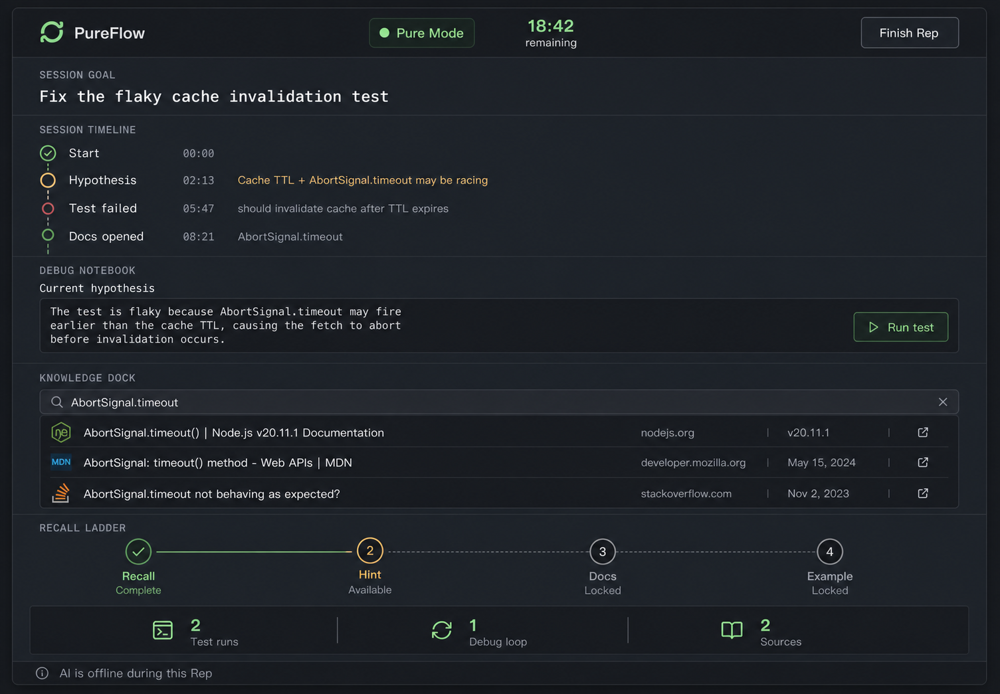
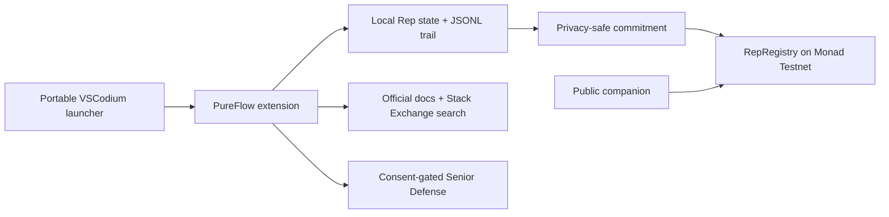

# PureFlow

PureFlow is a separate, portable VSCodium environment for deliberate coding practice. AI may prepare a focused Rep before the session and challenge your reasoning afterward; during Pure Mode, the implementation stays in your hands.



## Why a VSCodium distribution

PureFlow is shipped as a branded portable VSCodium profile with a bundled extension. The distribution provides the clean, AI-free boundary; the extension remains the reusable product core. This keeps upstream editor compatibility while giving each Rep an isolated profile, local state, and a launcher that disables common generation extensions for the session.

## Working product

- **Start Rep:** define a goal and choose a 25-minute, 90-minute, or full-day timebox.
- **Pure Mode:** visible AI-off boundary, timer, session timeline, local Debug Notebook, real workspace test task, Knowledge Dock, and progressive Recall Ladder.
- **Rep Card:** privacy-safe summary with focused time, test runs, debug loops, sources, and the developer's own outcome.
- **Senior Defense:** four gated review questions. Findings stay sealed until the developer answers; an optional OpenAI-compatible coach is only called after the Rep and only with explicitly selected context.
- **Monad attestation:** a completed Rep can produce a local commitment for `RepRegistry`; code, filenames, goals, and notes are never written onchain.
- **Public verifier:** the companion site performs a real read from Monad Testnet when a registry address is configured and never fakes a successful attestation.

## Try it

### Windows portable build

Download the latest release, extract it, and run `PureFlow.cmd`. The launcher uses an isolated profile and opens the Training Console automatically.

To build the distribution yourself:

```powershell
powershell -ExecutionPolicy Bypass -File .\distribution\build-windows.ps1
```

The builder downloads the latest official VSCodium archive, verifies its published SHA-256 checksum, packages the extension, and creates the portable folder under `release/`.

### Extension only

```powershell
cd extension
npm ci
npm run check
npm test
npm run package
```

Install the resulting `pureflow-0.1.0.vsix` in VS Code or VSCodium. Run **PureFlow: Open Training Console** or press `Ctrl+Alt+P`.

### Demo workspace

Open `demo/cache-lab` in the portable build. Its test exposes an intentionally inverted cache-expiry comparison. Start a Rep, write a hypothesis, run the default test task, fix the bug manually, and defend the invariant.

## Develop

Requirements: Node.js 22+, npm 10+, and PowerShell 7 on Windows for the distribution builder.

```powershell
# extension
cd extension
npm ci
npm run check
npm test

# contract
cd ..\contracts
npm ci
npm run build
npm test

# companion site
cd ..\web
npm ci
npm run build
npm run dev
```

## Architecture



The detailed boundaries are in [docs/architecture.md](docs/architecture.md). Product intent and anti-goals are in [PRODUCT.md](PRODUCT.md).

## Privacy and honest limits

PureFlow is voluntary focus infrastructure, not anti-cheat or employee surveillance. Code, filenames, terminal content, clipboard content, goals, and explanations stay local by default. The optional onchain record proves only that a wallet published a commitment with public aggregate counters; it cannot prove how someone worked or that a session increased skill.

## Spark hackathon

The practical problem comes first: developers need a credible way to keep manual debugging, recall, and explanation skills while using agents elsewhere. The Monad component is a small, real, privacy-safe attestation registry rather than a token-shaped excuse.

- [Spark alignment](docs/spark-alignment.md)
- [Submission packet](docs/submission.md)
- [Three-minute demo script](docs/demo-script.md)
- [Build process notes](process-notes.md)
- [Smart contract](contracts/src/RepRegistry.sol)

Built with the requested Monskills and Impeccable skill packs. Licensed under MIT.
