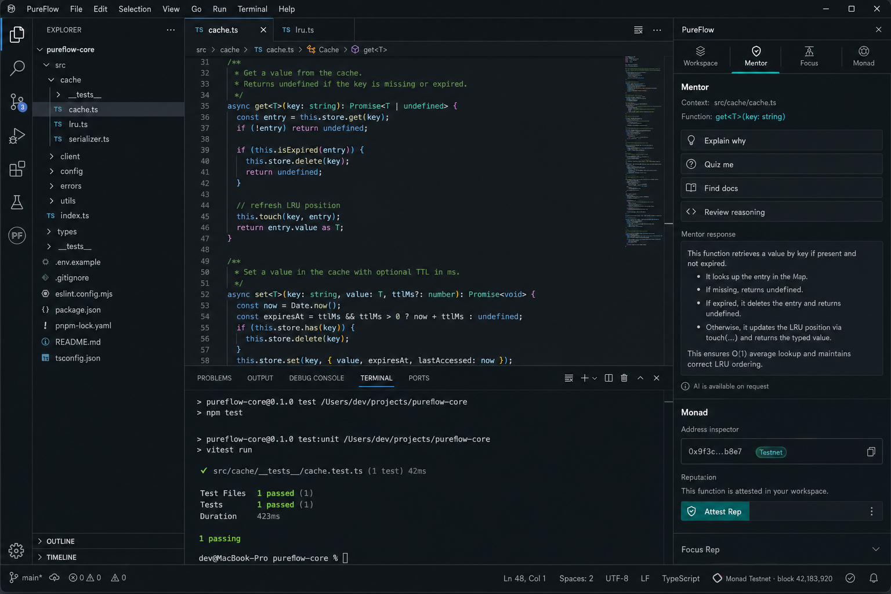
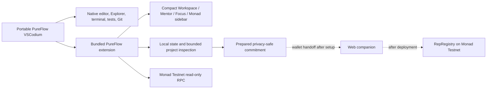

# PureFlow

PureFlow is a developer-first VSCodium distribution for people who ship with AI but do not want to lose architecture sense, debugging fluency, and ownership of their own code. Open a real repository, keep the native editor, Explorer, terminal, tests, debugger, and source control in the center, then call a compact sidebar when you want documentation, an explicit mentor action, an optional no-AI Focus Rep, or live Monad Testnet context.



## Why a separate VSCodium distribution

PureFlow is a separate portable IDE, but it does not maintain a deep editor fork. The distribution bundles an upstream-compatible extension, the **PureFlow Mineral** theme, restrained product branding, defaults, and an isolated profile. This gives the project its own installable identity without inheriting the long-term cost of patching Electron and the VSCodium workbench on every upstream release.

The extension remains independently installable in VS Code or VSCodium. It uses supported extension points: an Activity Bar `WebviewView`, editor context actions, command palette commands, a status-bar item, native workspace commands, and a color theme. PureFlow never opens a full-page training webview or toggles Zen Mode.

Selecting PureFlow opens it in the primary sidebar by default, like Explorer or Source Control. To keep Explorer and PureFlow visible together, use the view's **Move View → Secondary Side Bar** action; PureFlow does not force a global layout change.

## What works today

- **Native workspace:** open any folder, use the normal editor, terminal, test task, Git view, debugger, search, and extension ecosystem.
- **Project starters:** create an empty folder, a strict Node + TypeScript project, or a Monad + Hardhat starter configured for Testnet chain ID `10143`.
- **Compact sidebar:** Workspace, Mentor, Focus, and Monad are peer tools; none is required before editing.
- **On-demand mentor:** Explain (map control flow), Explain why (rebuild design story), Quiz me (probe what you still know), Find documentation (opens in the IDE Simple Browser when available), and Review reasoning. Each action needs an explicit selection or bounded current function. Results label a configured coach or the deterministic local guide.
- **Optional coach:** OpenAI-compatible endpoints including **Groq**. Configure via **PureFlow: Configure Optional Coach** — endpoint + model in settings, API key in VS Code SecretStorage (not a committed `.env`). Coach calls are blocked during an active Focus Rep.
- **Focus Rep:** optional knowledge-restoration loop on your real code — retrieve → hypothesize → verify → defend. Not a LeetCode catalog. Configured AI remains blocked while a Rep is active.
- **Live Monad workbench:** read Testnet chain health, latest/safe/finalized blocks and gas price; inspect an address or transaction; and run a read-only Project Doctor for Hardhat, Foundry, Solidity, viem, wagmi, and chain configuration.
- **Privacy-safe proof preparation:** a completed Rep can produce a local commitment payload with practice-policy flags (mentor blocked during Focus; private code offchain). It is labeled **Prepared, not published** until a user-controlled wallet submits a real transaction and the registry read confirms it. Onchain does not claim skill or absolute AI absence.
- **Portable product profile:** not an empty VSCodium fork — Mineral theme, deep defaults (inline AI suggest off, telemetry off), PureFlow keybindings, expanded AI-extension launcher shield, and branded product names.
- **Safe-governed release tooling:** production bytecode preparation is read-only; deployment is proposed only through the installed Monskills Safe wrapper; receipt validation requires the exact `RepRegistry` runtime; and a canonical Foundry payload prepares all-explorer source verification.

## How to run (short)

| Goal | Do this |
|------|---------|
| **Use the product** | Download [latest release](https://github.com/yava-code/PureFlow/releases/latest) → extract → run `PureFlow.cmd` → Open Folder |
| **Web demo** | https://yava-code.github.io/PureFlow/ |
| **Extension only** | Install VSIX from release or `cd extension && npm ci && npm run package` |
| **Full guide** | [`docs/HOW_TO_RUN.md`](docs/HOW_TO_RUN.md) |

Cover images: [`docs/design/spark-cover.jpg`](docs/design/spark-cover.jpg) (16:9), [`docs/design/spark-cover-square.jpg`](docs/design/spark-cover-square.jpg) (1:1).

## Try it

### Download the Windows release

Download [PureFlow v0.1.0](https://github.com/yava-code/PureFlow/releases/tag/v0.1.0), extract `PureFlow-win32-x64-0.1.0.zip`, and run `PureFlow.cmd`.

Portable SHA-256:

```text
651239343DAC42CD8D919EF78E115DE79E14983BB212F6208EC8D5C143FE13A5
```

### Build the Windows portable IDE

Requirements: Node.js 22+, npm 10+, Windows PowerShell 5.1+ or PowerShell 7, and Windows x64.

```powershell
git clone https://github.com/yava-code/PureFlow.git
cd PureFlow
$pureflowOutput = ".\release\portable-$(Get-Date -Format 'yyyyMMdd-HHmmss')"
powershell -ExecutionPolicy Bypass -File .\distribution\build-windows.ps1 -OutputRoot $pureflowOutput
```

The builder downloads the official VSCodium archive, verifies its published SHA-256 checksum, packages the extension, applies the PureFlow defaults and branding, and writes the portable distribution under the chosen output root. It refuses to overwrite an existing build. Launch the generated `PureFlow.cmd`, then open any normal repository.

### Install only the extension

```powershell
cd extension
npm ci
npm run check
npm test
npm run package
```

Install `extension/pureflow-0.1.0.vsix` in VS Code or VSCodium. Run **PureFlow: Open Workbench** or press `Ctrl+Alt+P`.

Useful editor actions:

- `Ctrl+Alt+Y` — Explain why for the current selection.
- `Ctrl+Alt+D` — Find the selected symbol in the documentation dock.
- Editor context menu → **PureFlow** — Explain, quiz, review reasoning, search docs, or inspect a selected Monad address/transaction.

### Create or open a project

Use **PureFlow: Open Project** for an existing folder or **PureFlow: Create Project** for one of the built-in starters. PureFlow delegates folder switching, terminals, tests, and source control to native VSCodium commands instead of recreating those surfaces in React.

### Optional Focus demo

Open `demo/cache-lab`. Its test exposes an intentionally inverted cache-expiry comparison. Work in the native editor first; when deliberate practice is useful, start a Focus Rep, record a hypothesis, run the test task, fix the bug manually, and defend the invariant.

## Develop

```powershell
# extension
cd extension
npm ci
npm run check
npm test
npm run build

# contract
cd ..\contracts
npm ci
npm run build
npm test

# companion site
cd ..\web
npm ci
npm test
npm run build
npm run dev
```

## Architecture



Read [the architecture](docs/architecture.md), [product intent](PRODUCT.md), [design system](DESIGN.md), and [end goal](docs/END_GOAL.md) before changing the product hierarchy. Current implementation, blockers, decisions, and chronological evidence live in [Project State](docs/PROJECT_STATE.md), [Decision Log](docs/DECISIONS.md), and [Build Log](docs/BUILD_LOG.md).

## Privacy and honest limits

PureFlow does not upload background files, absolute paths, terminal history, clipboard contents, or a repository. Mentor requests are explicit and bounded; file identity is reduced to a safe workspace-relative label or basename before it reaches a configured coach. Goals, code, filenames, notes, and answers stay offchain.

The extension remains visible in Restricted Mode with limited support. Its local guide and read-only tools remain available, configured coach calls stay disabled, workspace-defined network settings are ignored, and VSCodium continues to govern trust-sensitive native actions.

The `RepRegistry` contract and its tests exist, but the Testnet registry is not deployed yet. The encrypted agent wallet has 1 Testnet MON from a confirmed faucet transaction, so funding is no longer the immediate blocker. Monskills requires every contract deployment to be proposed through a Safe: creating the 2-of-3 Safe still needs two owner addresses from the project owner, and the canonical Para wallet flow requires the owner to authenticate separately. Until Safe execution, bytecode verification, and a follow-up contract read succeed, PureFlow does not claim an attestation is published or verified.

PureFlow is not anti-cheat, employee surveillance, a skill score, or proof that a session improved someone. The optional record proves only that a wallet published a particular privacy-safe commitment.

## Spark hackathon

The hackathon is a launch constraint for a useful open-source developer tool, not the product's reason to exist. Monad integration is limited to work that benefits from live chain data or a durable public commitment; normal coding, mentoring, documentation, and Focus history remain local.

- [Live companion](https://yava-code.github.io/PureFlow/)
- [Spark alignment](docs/spark-alignment.md)
- [Submission packet](docs/submission.md)
- [Three-minute demo script](docs/demo-script.md)
- [Build process notes](process-notes.md)
- [Smart contract](contracts/src/RepRegistry.sol)
- [Safe deployment and verification runbook](contracts/README.md)

Built with the requested Monskills and Impeccable skill packs. Licensed under MIT.
