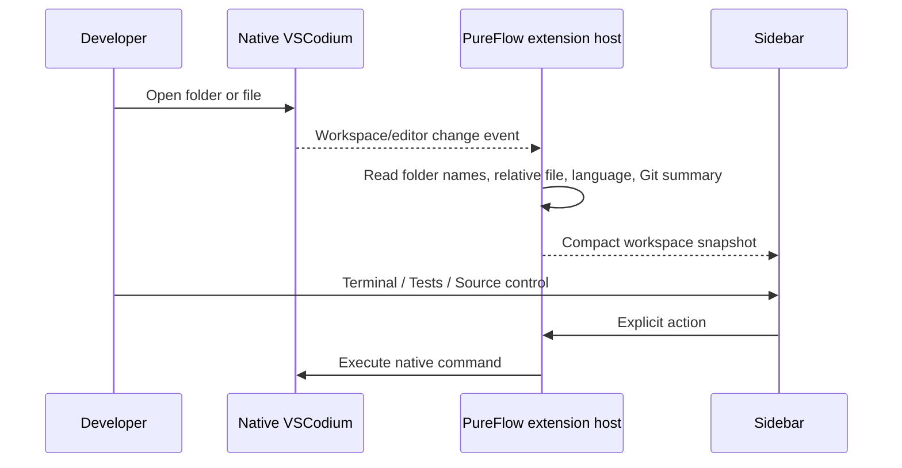
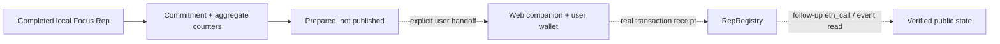

# Architecture

PureFlow is an upstream-compatible VSCodium distribution with one bundled extension and a separate web companion. Native IDE surfaces own project work; PureFlow adds bounded context and optional workflows around them.

```text
PureFlow portable VSCodium
├── upstream editor, Explorer, search, debugger, terminal, tests, Git, extensions
├── isolated data/extensions profile and PureFlow Mineral theme
├── restrained product naming and defaults
└── bundled PureFlow extension
    ├── WorkspaceService: folder snapshot, native commands, project starters
    ├── selection boundary: explicit selection or bounded current function
    ├── Coach + Knowledge: local guide, optional endpoint, documentation search
    ├── Focus domain + local store: Rep state, evidence, defense, commitment
    ├── Monad services: bounded RPC, inspector, read-only Project Doctor
    ├── status bar and editor/command-palette actions
    └── one compact Activity Bar WebviewView

Web companion
├── public project surface
├── live read-only Testnet verification when a registry is configured
└── future user-controlled wallet handoff after Para setup

RepRegistry
├── storage: commitment → attestor and wallet → attestation count
├── event: self-reported aggregate counters + chain timestamp after deployment
└── release tools: Safe bytecode preparation, receipt/runtime validation, source verification payload
```

## Workbench boundary

The native editor is the center of the product. `pureflow.open` reveals the Activity Bar view with `workbench.view.extension.pureflow`; it does not create a `WebviewPanel`, replace an editor tab, or enter Zen Mode. The sidebar routes are Workspace, Mentor, Focus, and Monad.

Workspace actions delegate to supported VSCodium commands:

- open or change a folder through the native folder dialog;
- open the integrated terminal at the active workspace;
- run the configured native test task;
- open native source control;
- create a small project starter, then open that folder normally.

The distribution carries branding and defaults, while the extension remains independently installable. This is intentional: a deep VSCodium fork would add updater, Electron, workbench, security, and merge maintenance without improving the current product boundary.

## Runtime data flows

### Workspace



The snapshot contains presentation context, not file bodies. Git access is used for branch/change state and, only during an explicitly consented post-Rep defense, an optional bounded diff.

### Mentor and documentation

An editor context action captures either the selected text or, for **Quiz current function**, a bounded document-symbol range. The extension sends a sanitized workspace-relative label or basename, language, line range, and at most the permitted code slice to the mentor service only after the user invokes the action.

The host rejects configured coach calls during an active Focus Rep and whenever the workspace is untrusted. Without a configured endpoint, a deterministic local guide remains available and is labeled `local guide`; it does not pretend to be model analysis. Documentation search combines a local source catalog with live Stack Exchange results and opens sources externally.

Background files, absolute paths, terminal history, clipboard data, and whole repositories do not enter this flow.

### Monad read path

The extension host owns JSON-RPC calls so the webview never receives an unrestricted network capability. `MonadRpcClient` validates HTTP(S), enforces a bounded timeout, verifies chain ID `10143`, and parses quantities before presenting them.

The current read path supports:

- Testnet latest, safe, and finalized block state, latency, and fee snapshot;
- address balance, nonce, bytecode presence, and account/contract classification at the safe block;
- transaction presence, receipt status, confirmations, finality, gas used, effective gas price, logs, and explorer link;
- bounded local Project Doctor detection for Hardhat, Foundry, Solidity, viem, wagmi, and Monad Testnet configuration.

Project Doctor is read-only, ignores dependency/build/output directories, and reports when depth or file limits truncate a scan.

### Focus and proof path

Focus Rep state is stored locally and records workflow events rather than keystrokes or surveillance telemetry. Test/debug counters are user-recorded workflow evidence, not parsed test-runner output. A completed Rep can be reduced to a commitment and self-reported public counters. Code, paths, goals, hypotheses, notes, answers, and the full local summary are excluded from the onchain payload.



The solid path is implemented locally. The dotted write/verification path remains blocked until Para is authenticated and `RepRegistry` is Safe-deployed, source-verified, and configured. No runtime should display `Published` or `Verified` before the receipt and follow-up read support it.

Contract release is a separate governed path. `prepare-safe-deployment.mjs` reads the production artifact without a key or broadcast. The installed Monskills `propose.sh` wrapper is the only allowed proposer after the 2-of-3 Safe exists. After owner execution, `verify-safe-deployment.mjs` decodes the indexed CreateCall event and requires the deployed runtime bytecode to exactly match `RepRegistry`. Hardhat and Foundry production profiles use identical compiler/EVM/optimizer settings and omit the source-dependent bytecode hash; the source-verification preparer refuses to emit an all-explorer request unless both compiler outputs match byte-for-byte.

## Storage and trust boundaries

- Rep state and JSONL events live in extension global storage.
- Coach credentials live in VS Code `SecretStorage`.
- Project files remain in the user's workspace; Project Doctor does not mutate them.
- Restricted Mode support is `limited`: configured coach calls are disabled and workspace values for coach, RPC, contract, companion, and AI-extension settings are ignored.
- The IDE stores no wallet private key.
- The companion receives a prepared payload only through an explicit handoff.
- The contract stores only the commitment-to-attestor mapping and each wallet's attestation count. Focused seconds, test/debug counters, ownership self-report, and `block.timestamp` are emitted in `RepAttested`.
- All RPC-backed values retain explicit loading, unavailable, pending, safe, finalized, failed, or deployment-pending states.

## Repository boundaries

- `extension/` — extension host, sidebar, theme, tests, VSIX packaging.
- `distribution/` — reproducible Windows portable VSCodium builder and defaults.
- `web/` — Spark/GitHub Pages companion and future wallet handoff.
- `contracts/` — `RepRegistry`, Hardhat/Foundry profiles, contract/tool tests, and Safe release tooling.
- `demo/` — intentionally broken manual Focus fixture.
- `docs/` — product handoff, decisions, state, build evidence, design, demo, and submission material.

Durable rationale is recorded in [DECISIONS.md](DECISIONS.md), current implementation and blockers in [PROJECT_STATE.md](PROJECT_STATE.md), and the end-state acceptance contract in [END_GOAL.md](END_GOAL.md).
