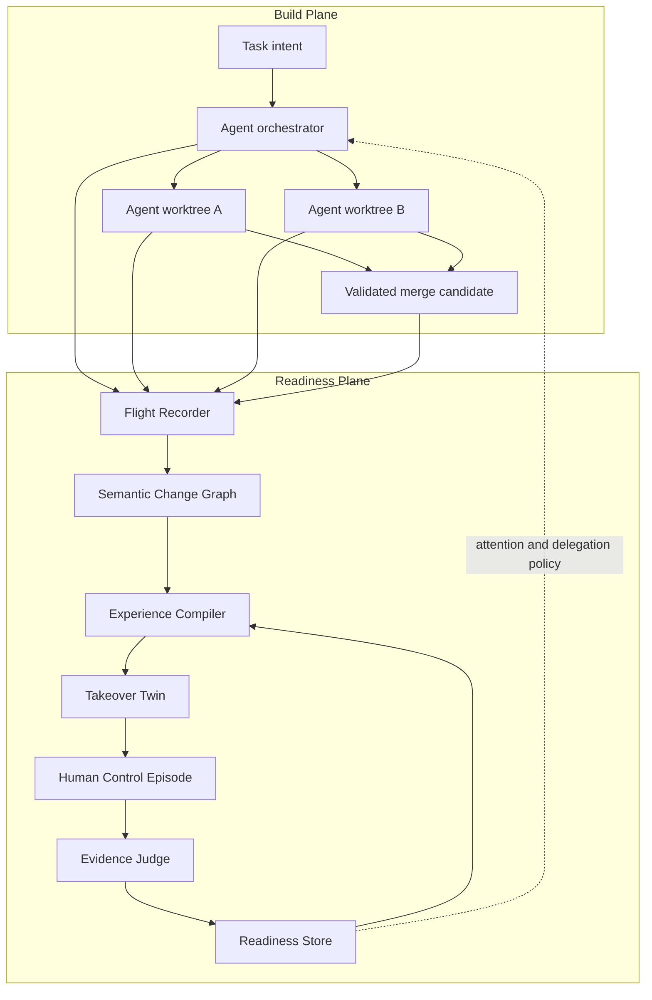

# ADR-001: Dual-Control Architecture

- **Status:** Proposed for R&D validation
- **Date:** 2026-07-25
- **Decision owners:** PureFlow project
- **Supersedes for new R&D:** the v0.1 Mentor/Focus thesis and the unvalidated v0.2 post-run comprehension-gate direction

## Context

PureFlow v0.1 is a real VSCodium distribution with an optional mentor and manual Focus Rep. That product does not provide modern autonomous coding comparable to Cursor, Codex, Claude Code, or Windsurf. A proposed post-run “Ownership Compiler” still centered explanations and questions after agents wrote code. Current products already implement learning output styles, manual `TODO` handoffs, codebase tutors, active recall, repository lessons, dependency maps, and injected debugging games.

The product goal is different:

- keep full agentic implementation;
- avoid line-by-line review as the primary control mechanism;
- preserve the developer's project-specific ability to predict, diagnose, change, and recover the system;
- keep human practice outside the production critical path by default;
- produce behavioral evidence rather than a self-reported comprehension score;
- preserve native IDE surfaces and avoid a high-maintenance VSCodium source fork until required.

Human-automation research suggests that passive monitoring does not preserve failure-time performance. Learning research suggests that generation, error, practical operation, and delayed transfer matter. Direct proof for this exact software architecture does not yet exist, so the first implementation must be an experimentable vertical slice.

## Decision

PureFlow will use a **dual-control architecture** with two coupled but independently scheduled planes.

### Build Plane

Existing coding-agent runtimes perform planning, file editing, command execution, testing, repair, and parallel worktree execution. PureFlow owns an adapter contract and orchestration UI, not a new general-purpose coding model or shell loop.

### Readiness Plane

PureFlow captures observable run events, compiles a semantic change graph, selects a high-value causal seam, creates a disposable Takeover Twin, judges a human control episode with executable evidence, and stores scoped readiness evidence. That evidence informs future episode selection and, later, optional delegation policy.

Production execution does not wait for a control episode unless the user explicitly enables a gate for a high-risk scope.

There are two scheduling modes:

- **continuity rehearsal** runs entirely off the production path;
- **live steering** may place only final integration of a selected high-leverage fork behind a bounded human choice while agents speculatively execute alternatives and continue unrelated tasks. Skipping uses the configured autonomous policy and records no human-decision evidence.



## Components

### 1. Agent Adapter

A narrow interface wraps one or more existing engines. It must expose observable events without requiring hidden chain-of-thought.

The normative `AgentTask`, `AgentWorkspace`, `AgentRun`, `AgentDriver`, event-ordering, and serialization contracts are defined in [`CONTRACTS.md`](CONTRACTS.md). Vendor-specific events stop at this adapter boundary.

The initial spike supports one driver. Multi-agent routing is not required to validate the readiness mechanism.

### 2. Flight Recorder

An append-only local event log records only observable facts:

- task and bounded user intent;
- timestamps and run/worktree identifiers;
- file edits and revision hashes;
- commands and exit status;
- test identifiers and outcomes;
- explicit agent plans or decisions when emitted;
- merge and rollback events.

The Flight Recorder must not fabricate rationale or depend on private model reasoning traces.

Raw terminal output, absolute paths, secrets, and unbounded repository content are not automatically persisted.

### 3. Semantic Change Graph

The graph groups textual changes into claims about behavior and structure. Nodes may represent requirements, symbols, tests, runtime observations, dependencies, and invariants. Edges are evidence-bearing relationships such as `implements`, `calls`, `covers`, `changes`, `observed-by`, or `contradicts`.

The first version may use changed symbols, static references, test coverage, and Git metadata. A universal code graph is not an MVP prerequisite.

### 4. Experience Compiler

The compiler ranks candidate seams using a policy that is explainable and replaceable:

```text
value = blast_radius
      × novelty
      × evidence_gap
      × readiness_decay
      × expected_takeover_frequency
      ÷ estimated_attention_cost
```

This formula is conceptual. Real weighting must be learned through experiments, and the UI must show why a seam was selected.

The compiler emits separate controller-only and participant manifests defined in [`CONTRACTS.md`](CONTRACTS.md). Source revisions, setup changes, judge internals, and the hidden answer never enter the participant payload. Commands are references into an immutable, explicitly approved registry rather than free-form shell text.

### 5. Takeover Twin

The twin is a disposable, sanitized Git repository plus the smallest reproducible runtime needed for the episode. It can contain:

- the pre-change state with a required adjacent modification;
- the completed patch with a known mutation;
- a counterfactual implementation;
- a recorded test or trace with an altered invariant;
- a bounded mock or container for an unavailable dependency.

The twin must never share the source repository's object database, refs, reflogs, remotes, or hidden answer. The controller exports a tree, applies the exercise change before initializing a one-commit participant repository, and keeps the oracle outside that repository. Creation, commands, and cleanup remain explicit and recoverable. Product use is voluntary rather than anti-cheat; controlled studies use the stricter isolation protocol in [`CONTRACTS.md`](CONTRACTS.md).

### 6. Evidence Judge

The judge uses tests, traces, static constraints, benchmarks, or exact state checks. LLM evaluation may provide feedback on reasoning, but cannot be the only acceptance oracle. It evaluates an allowed participant diff against a clean controller-owned snapshot and protected hidden oracle; it never trusts modified tests or command wrappers inside the participant tree. The normative integrity protocol and `JudgeResult` live in [`CONTRACTS.md`](CONTRACTS.md).

### 7. Readiness Store

The store is local and project-scoped. It records evidence events, not a mutable opaque score. Immediate prediction/intervention/recovery produces `CapabilityEvidence`; only a delayed adjacent task can create `VerifiedReadiness`. Both contracts are defined in [`CONTRACTS.md`](CONTRACTS.md). Evidence can become stale when time passes or relevant behavior changes. There is no cross-developer leaderboard and no automatic employer export.

### 8. Autonomy Router

The router accepts the user's attention budget and readiness evidence. In v0.3 it chooses experiences only; it does not block agent execution. A later experiment may let it recommend that the human lead a real high-risk seam.

After recovery episodes validate the mechanism, the next router experiment is speculative live steering: fork two viable designs, collect comparable executable evidence, and let the human's choice determine the integrated branch without requiring them to type the implementation.

ADR-009 formalizes that later experiment as a Decision Future with a precommitted autonomous default, bounded integration deadline, false-fork abstention, live-influence evidence, and a Takeover Envelope. It remains gated and does not change the implemented R0–R4.5 path.

## Options considered

### Option 1: Extend the v0.1 Mentor and Focus Rep

**Rejected as the product core.** It preserves a manual mode but does not offer modern autonomous construction or connect real agent work to measurable takeover readiness.

### Option 2: Post-run Ownership Compiler with explanations and questions

**Rejected as the product core.** It improves navigation but remains passive and overlaps with Claude Learning, comprehension gates, and codebase tutor skills.

### Option 3: Require the developer to implement selected functions

**Rejected as the default.** It puts practice on the critical path, may choose low-value work, and does not reliably exercise diagnosis or recovery.

### Option 4: Build or fork a complete Cursor-like agent system first

**Rejected for R&D.** Generic agent editing and orchestration are expensive, rapidly commoditizing, and not the differentiating hypothesis. Existing runtimes should be adapted until the readiness mechanism is validated.

### Option 5: Separate project debugging game

**Rejected as the complete product.** It creates useful practice but is detached from current work, future delegation, and production throughput.

### Option 6: Dual-Control Development

**Selected.** It is the only option that combines autonomous speed, active project-local operation, executable evidence, and a feedback path into future orchestration.

## Trade-offs

### Benefits

- preserves agent autonomy and native IDE workflow;
- makes the human capability an explicit system output;
- creates falsifiable behavioral metrics;
- concentrates attention on high-value seams;
- stays agent-engine agnostic;
- can begin with a narrow tested stack.

### Costs

- requires reproducible environments and deterministic tests;
- scenario generation is substantially harder than summary generation;
- semantic selection can be wrong or annoying;
- readiness evidence is probabilistic and must be carefully scoped;
- distributed and stateful systems may resist minimal twins;
- delayed-transfer studies slow product validation.

### Risks accepted

- early versions will support only changes with executable local evidence;
- some agent runs will produce no valid experience;
- architecture and product names may change after research;
- the existing v0.1 implementation will remain in the repository during the experiment.

## Consequences

- PureFlow is no longer positioned as “AI that waits to be asked.” Autonomous agents are a first-class build plane.
- Mentor explanations and Focus Reps become legacy v0.1 capabilities, not the v0.3 thesis.
- No new quiz, comprehension score, or manual coding gate should be implemented unless it is part of a complete control episode.
- The first code milestone is an agent adapter plus Flight Recorder and Takeover Twin spike, not UI polish.
- Product claims must use `target`, `hypothesis`, or `pilot result` until delayed transfer is measured.
- `Shadow Workspace` must not be used as a PureFlow name because Cursor already owns that term in this category.

## Action items

1. Implement the smallest observable `AgentDriver` for one existing runtime.
2. Capture a normalized Flight Recorder stream for at least ten representative test-backed patches.
3. Build a deterministic standalone sanitized twin that applies one change-derived mutation and exposes a failing test without sharing source Git objects.
4. Validate that the Evidence Judge reproduces expert-labeled outcomes.
5. Run the technical and human pilots in [`EXPERIMENTS.md`](EXPERIMENTS.md).
6. Do not build a generalized semantic graph, swarm orchestrator, or production readiness policy before the vertical slice passes its gates.
7. Revisit this ADR after the first delayed-transfer pilot; accept, revise, or reject it with evidence.
