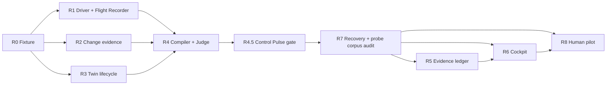

# Agent Execution Plan

## How to use this plan

An implementation agent must read, in order:

1. `AGENTS.md`;
2. `prd.md`;
3. every document in `docs/v0.3/`;
4. current `extension/package.json` and relevant source/tests;
5. `docs/PROJECT_STATE.md` and the latest `docs/BUILD_LOG.md` entry.

This plan is executable for the technical R&D spike. It is not permission to claim that skill retention works, redesign unrelated v0.1 surfaces, publish user data, or continue past a failed research gate.

`docs/v0.3/CONTRACTS.md` is normative. If this plan, the ADR, or an implementation idea conflicts with those schemas or isolation rules, stop and update the contract through an ADR before coding.

Every persisted digest must use the domain-separated RFC 8785 algorithm in `CONTRACTS.md`. The owner of each workstream adds Windows/Linux golden vectors for its hash domains; a passing same-platform round trip is not sufficient.

## Delivery strategy

Use a small sequential pipeline for the first vertical slice. Parallel agent swarms are unnecessary until the contracts are stable.

```text
observable agent run
→ normalized Flight Recorder
→ one test-backed seam
→ disposable Takeover Twin
→ deterministic judge
→ local readiness evidence
→ minimal cockpit
```

Each phase ends in a coherent commit with tests. A downstream phase may start only when its acceptance checks pass.

Workstream IDs are stable references, not permission to execute in numeric order. The dependency graph is authoritative: R4.5 follows the guarded R0–R4 mechanism, and R7 gates all R5/R6 product-state/UI work.

## Target repository shape

New v0.3 runtime code should live under focused modules:

```text
extension/src/
  agent/          agent-driver contract and first adapter
  recorder/       normalized event model and local event store
  change/         changed-symbol and evidence extraction
  experience/     candidate selection and manifest compiler
  pulse/          post-R4 claim, capsule, and catalog-probe contracts
  twin/           sanitized snapshot and standalone twin lifecycle
  judge/          executable checks and result model
  readiness/      local evidence ledger and derived state
  cockpit/        host-to-webview messages for v0.3 UI

extension/fixtures/v0.3/
  tenant-cache-key/  packaged finite candidate states and controller assets

extension/test/
  fixtures/v0.3/  replay transcripts and other test-only evidence
  agent.test.ts
  flight-recorder.test.ts
  experience.test.ts
  twin.test.ts
  judge.test.ts
  readiness.test.ts
```

Do not mix experimental code into Monad, contract, or proof modules. Legacy Mentor/Focus code remains intact until a later extraction decision.

Event-driven Control Pulses, Side Coach calls, streaks, achievements, and any leaderboard remain outside R0–R4. After R4, only the R4.5 contract gate below may add a deterministic fixture-only Explain-to-Break probe. Persistent state and cockpit presentation still require the R7 gate; motivation features require human-pilot evidence.

## Workstream R0 — Baseline and fixture contract

**Goal:** establish a reproducible local target before integrating an external agent.

### Tasks

- Create a tiny TypeScript fixture with a passing base revision and a passing target revision that changes behavior at a tested boundary.
- Include one deterministic mutation that makes a named test fail.
- Create a fixture factory that initializes a temporary Git repository during tests; do not commit nested `.git` directories.
- Record expected revisions, changed symbols, test IDs, the exact `base`/`target`/`mutated` tree manifests, and the known repair in a fixture manifest.
- Implement the exact `FixtureManifest` from `CONTRACTS.md`.
- Pin LF fixture files through `.gitattributes`, Git identity and dates, `core.autocrlf=false`, `main` as the initial branch, Node version, and the controller-owned harness hash. The fixture has no package installation or downloaded dependency.
- Verify deterministic fixture creation, revisions, tree hashes, LF behavior, and cleanup on Windows and Linux CI.

### Acceptance

- fixture can be created from an empty temp directory;
- base and target test commands pass;
- mutation produces the expected failing test;
- known repair returns the suite to green;
- test cleanup leaves the real repository unchanged;
- the same fixture revisions and file hashes are produced on Windows and Linux;
- `npm run check` and `npm test` pass in `extension/`.

### Stop condition

Do not build the UI or agent adapter if a deterministic disposable Git fixture cannot be made reliable on Windows.

## Workstream R1 — AgentDriver and Flight Recorder

**Goal:** capture observable evidence from one real or simulated coding-agent run behind a stable adapter.

### Files

- `extension/src/agent/types.ts`
- `extension/src/agent/driver.ts`
- `extension/src/agent/replay-driver.ts`
- `extension/src/recorder/events.ts`
- `extension/src/recorder/store.ts`
- corresponding tests

### Tasks

- Define `AgentTask`, `AgentWorkspace`, `AgentRun`, `AgentDriver`, and normalized `RunEvent` contracts from ADR-001.
- Implement the normative schema version, project/run identity, sequence, revision, evidence-reference, and storage rules from `CONTRACTS.md`; do not create a second local variant.
- Implement a replay driver over a checked fixture transcript. This lets downstream R&D proceed without network credentials.
- Store events append-only under extension-owned local storage through an injected filesystem interface.
- Redact or omit absolute paths, environment values, raw credentials, and unbounded terminal output.
- Reject out-of-order terminal events or make ordering semantics explicit.
- Add schema versioning from the first event.

### Acceptance

- the replay driver yields the same normalized sequence on repeated runs;
- event serialization round-trips;
- missing/duplicate sequence numbers, duplicate or mismatched execution IDs, cross-project evidence refs, and events after `run.finished` are rejected;
- absolute workspace roots and known secret fixtures do not appear in stored output;
- cancellation and failed-run status are represented honestly;
- no external model or API key is required for tests.

### Decision gate

After replay works, select one external engine for a narrow live adapter spike. Compare current official APIs for Claude Code, Codex, OpenCode, Cline/Roo, or an Agent Client Protocol implementation. Record the choice in a new ADR; do not let vendor-specific events leak into domain contracts.

## Workstream R2 — Change evidence extractor

**Goal:** identify a behavior-relevant, test-backed seam without pretending to solve universal program comprehension.

### Files

- `extension/src/change/diff.ts`
- `extension/src/change/symbols.ts`
- `extension/src/change/evidence.ts`
- corresponding tests

### Tasks

- Parse the Git diff between base and target revisions.
- Resolve changed TypeScript functions/classes using the TypeScript compiler API or a narrow parser justified in an ADR.
- Link changed symbols to explicit test commands and fixture-declared test IDs.
- Emit the exact `ExtractionResult`, `SemanticUnit`, and `CandidateSeam` contracts from `CONTRACTS.md`, including reason codes, evidence references, normalized/unknown factors, attribution status, and explicit gaps.
- Never fabricate an invariant from an LLM response as a fact.

### Acceptance

- extractor identifies the expected fixture boundary;
- rename, multi-file, added-function, and deleted-function cases have tests;
- unsupported syntax yields `unsupported` or partial evidence, not a plausible-looking success;
- paths remain workspace-relative;
- extraction is deterministic for a revision pair.

### Stop condition

If the vertical slice requires a generalized knowledge graph before it can identify one test-backed seam, narrow the supported fixture rather than building the graph.

## Workstream R3 — Takeover Twin lifecycle and command boundary

**Goal:** create, validate, and remove a disposable fixture environment without touching the production checkout or implying that arbitrary code is isolated.

### Files

- `extension/src/twin/types.ts`
- `extension/src/twin/snapshot.ts`
- `extension/src/twin/manager.ts`
- `extension/src/twin/catalog.ts`
- `extension/src/twin/commands.ts`
- `extension/test/twin.test.ts`

### Tasks

- Resolve and validate the controller repository and target revision without exposing either to participant code.
- Export the target tree without Git metadata, apply the exercise change, then initialize the standalone one-commit participant repository required by the hidden-answer protocol in `CONTRACTS.md`.
- Create a uniquely named temporary twin and evaluation directory outside the production worktree; neither may use Git alternates or a shared object database.
- Implement the immutable command-registry snapshot, extension-owned `TrustedFixtureCatalog`, and `TrustedFixtureRunner` from `CONTRACTS.md`: open only by committed `fixtureId + manifestHash`, resolve `fixture-node` through the runner-owned catalog to a hash-verified standalone Node artifact (never `process.execPath` or ambient `PATH`), require an exact full-tree hash match against a declared fixture state, and use argument arrays, `shell: false`, a scrubbed environment, bounded output/time, full Windows process-tree termination, and no package installation.
- Expose non-fixture execution as `unsupported` until a separate ADR selects and verifies a `SandboxRunner` with network, host-filesystem, oracle-mount, process-tree, and resource isolation. Do not silently fall back to the trusted-fixture path.
- Expose lifecycle states: `preparing`, `ready`, `running`, `completed`, `failed`, `cleaning`, `cleaned`.
- On cleanup, verify the exact resolved twin and evaluation directories before removing either one.
- Preserve a failed twin for inspection only after an explicit user choice.
- Allocate a unique `ExecutionId` per invocation and maintain an execution-to-process-tree registry so identical commands can run and cancel independently across twins.

### Acceptance

- production working-tree files, index, symbolic `HEAD`, `HEAD` commit, pre-existing refs, remotes, and worktree list match their captured values after a test;
- two twins can coexist without branch or directory collision;
- cancellation cleans resources;
- two twins can run the same `commandId` concurrently; cancelling one `ExecutionId` leaves the other invocation running and able to complete;
- timeout and failing setup remain failure states;
- Windows paths with spaces are covered;
- locked files and a descendant process are terminated and cleaned on Windows;
- every workspace/corpus/participant command, caller-provided manifest, untrusted toolchain handle, and non-declared tree state is rejected by `TrustedFixtureRunner`; unknown command IDs, changed fixture/catalog hashes, reused execution IDs, inherited credential fixtures, and a non-fixture request all fail closed;
- the participant repository contains no source remote, production OID, reflog, alternate, or hidden-answer evidence;
- cleanup restores the captured production worktree list and leaves no attributable temporary repository or evaluation directory;
- recursive cleanup never targets the workspace root or an unresolved path.

## Workstream R4 — Experience Compiler and Judge

**Goal:** compile one changed seam into a recovery manifest and validate its protected-judge data flow against the finite reviewed fixture states.

### Files

- `extension/src/experience/types.ts`
- `extension/src/experience/select.ts`
- `extension/src/experience/compile.ts`
- `extension/src/judge/types.ts`
- `extension/src/judge/run.ts`
- corresponding tests

### Tasks

- Implement the versioned experience manifests.
- Use the separate `InternalExperience` and `ParticipantExperience` contracts from `CONTRACTS.md`; source revisions, judge internals, setup changes, and hidden answers must never enter cockpit messages or participant-agent context.
- Start with `recover` episodes only; do not claim the other episode kinds are implemented.
- Select a seam using deterministic supported evidence and a transparent reason list.
- Materialize the participant twin through the sanitized one-commit isolation protocol rather than merely hiding a field or Git ref.
- Exercise diff calculation, protected-path rejection, clean evaluation materialization, and controller-owned hash-verified oracle tests using only the manifest's controller-applied `knownRepair`, whose resulting tree must exactly match the declared `target` state before `TrustedFixtureRunner` executes it. Reject every other candidate without execution. After R7's backend gate, the same judge contract may evaluate arbitrary participant code through the isolated `SandboxRunner`.
- Record hints, time, checks, and outcome without awarding a scalar skill score.

### Acceptance

- the compiler creates the expected fixture episode from Flight Recorder data plus change evidence;
- user-facing serialization contains none of the source run/revision, setup, judge, oracle, or hidden-answer fields;
- `git show`, reflog, remotes, object enumeration, and environment inspection inside the twin cannot recover the target commit or production path;
- the declared `mutated` state fails, the controller-applied known repair reproduces `target.treeHash` and passes, and every non-declared candidate tree is rejected without execution;
- an unrelated change that happens to compile but violates the target behavior fails;
- editing tests, package scripts, lockfiles, command wrappers, or any protected path yields `failed-integrity`, never `passed`;
- a clean evaluation replay produces the same judge result three times;
- judge output contains evidence references and exact command status;
- LLM availability cannot change pass/fail.

### Kill signal

If a coherent episode cannot be produced without hand-writing logic for each patch, pause UI work and run Experiment 1 over the corpus.

## Workstream R4.5 — Fixture-only Control Pulse gate

**Entry gate:** R4 passes. This workstream is required before R7, but it cannot weaken R0–R4 or expand the guarded Jules queue beyond its reviewed stopping point.

**Goal:** prove one bounded Explain-to-Break interaction without adding arbitrary execution, network authority, or readiness claims.

### Files

- `extension/src/pulse/types.ts`
- `extension/src/pulse/validate.ts`
- `extension/src/pulse/capsule.ts`
- `extension/src/pulse/catalog.ts`
- corresponding tests

### Tasks

- Implement the exact `ChangeClaim`, Side Coach, catalog probe, attempt, and result schemas from `CONTRACTS.md` §8.5 with domain-separated hashes and golden vectors.
- Commit the bounded developer-visible prompt and input labels inside the internal-probe hash; derive participant and Side Coach surfaces only as exact projections of that reopened object.
- Reject unknown fields, oversized text/arrays, absolute paths, unsorted or duplicate evidence, unknown/cross-project refs, non-participant visibility, unstable checkpoints, and mismatched hashes.
- Build a redacted capsule locally and prove that controller/oracle evidence, evidence IDs, absolute paths, secret fixtures, terminal history, and repository-wide source cannot enter it.
- Add a finite extension-owned probe catalog for the reviewed fixture. Each probe may select only an existing declared state/check pair; it cannot supply code, a patch, command arguments, environment, or a new test.
- Precommit the participant attempt hash before execution, run the selected pair through `TrustedFixtureRunner`, and store the bounded observation separately from any model annotation.
- Bind every attempt once to its controller-issued ID, project, internal probe, claim hash, fixture manifest, catalog allowlist, and a sorted subset of the claim evidence. Tombstone all terminal attempts and reject replay or cross-project/hash reuse.
- Treat timeout, cancellation, setup/launch failure, missing output, and runner error as `execution-error`; none may confirm a prediction that the check would fail.
- Start with the deterministic no-model path. A configured Side Coach adapter may be added only after the same validator and capsule tests pass; its output remains an untrusted catalog selection or clarification.
- Keep results in the experiment layer. Do not persist or display readiness before the R7→R5/R6 gates.

### Acceptance

- serialization round-trips and Windows/Linux golden hashes match;
- every malicious or malformed claim/capsule fixture fails closed before a network call;
- a model proposal containing code, args, paths, an unknown probe ID, or an oracle/controller ID cannot affect execution;
- the runner receives exactly one catalog-owned fixture state/check pair and no model/developer-authored executable material;
- prediction is committed before observation; skip/reveal/late/integrity-failed paths cannot yield passed evidence;
- prompt, label, input-order, or participant-projection drift fails integrity before an attempt;
- timeout, cancellation, setup/runner failure, replay, and identity mismatch cannot yield passed evidence;
- changing prose quality while keeping the same committed prediction and executable observation cannot change the result;
- no external model is required for tests, and production agent execution remains non-blocking.

### Stop condition

If the fixture-only probe needs arbitrary participant code or model-generated tests, stop R4.5 and wait for the R7 sandbox decision rather than widening Phase A.

## Workstream R5 — Readiness evidence ledger

**Entry gate:** R7 technical corpus audit passes its preregistered threshold.

**Goal:** store behavioral evidence without inventing a universal score or calling immediate performance verified readiness.

### Files

- `extension/src/readiness/types.ts`
- `extension/src/readiness/store.ts`
- `extension/src/readiness/derive.ts`
- corresponding tests

### Tasks

- Append `CapabilityEvidence` and `VerifiedReadiness` events exactly as defined in `CONTRACTS.md`, keyed by a local project ID and scoped symbol/concept labels.
- Derive the strongest immediate capability evidence and its age separately from verified delayed-transfer readiness; keep failures and assistance visible.
- Invalidate or mark stale evidence when the relevant symbol changes materially.
- Add an explicit delete/export API. No network sync in the R&D slice.

### Acceptance

- both evidence types round-trip and are isolated between project IDs;
- a quiz, explanation, prediction, or immediate recovery cannot create `VerifiedReadiness`;
- assisted completion remains distinguishable from unassisted completion;
- only a delayed adjacent judge result with its prior evidence hashes can create `level: "transferred"`;
- relevant code changes mark previous evidence stale;
- delete removes all local evidence for the selected project.

## Workstream R6 — Minimal cockpit

**Entry gate:** R7 technical corpus audit passes its preregistered threshold.

**Goal:** expose the mechanism inside native IDE surfaces without turning the editor into a course.

### Product surface

- compact Activity Bar view or secondary sidebar;
- agent run state;
- changed-behavior/evidence summary;
- one `Take over` action when a valid episode exists;
- session attention budget `0 / 5 / 15`;
- twin state and clear production/twin identity;
- evidence result and age;
- skip and delete controls.

### Tasks

- Add versioned host/webview messages under `extension/src/cockpit/` and the existing webview code.
- Keep the native editor active. Opening a twin should use a new native window or clearly labeled workspace context, not a full-page training webview.
- Do not remove legacy routes in this spike; label the v0.3 surface experimental.
- Make all actions keyboard accessible and correct at narrow sidebar widths.

### Acceptance

- no `createWebviewPanel` path is introduced;
- user can distinguish production and twin at all times;
- normal project work proceeds when budget is zero or an episode is skipped;
- running agents do not wait for the episode;
- no fake readiness label appears before judge evidence;
- immediate evidence is labeled `capability evidence`; only a completed delayed adjacent task can display `verified takeover readiness`;
- extension check, tests, build, and VSIX packaging pass.

## Workstream R7 — Technical corpus audit

**Goal:** run Experiment 1 before expanding features.

**Entry gate:** R4.5 passes and one concrete Windows-capable `SandboxRunner` is selected in a new ADR. The ADR must document prerequisite detection/provisioning, a hash-pinned image or offline dependency cache, network-none and host-filesystem tests, mount policy, read-only oracle delivery, resource limits, and Windows process-tree cleanup. If no backend is available, R7 is blocked; R0–R4.5 evidence remains fixture-only.

### Tasks

- Preregister patch eligibility, repository sampling, unsupported-case rules, and exact primary metrics before inspecting compiler outcomes.
- Collect a development corpus and a separate held-out corpus of at least 30 eligible consented or open-source test-backed TypeScript patches in total; never redefine “supported” after seeing failures.
- Freeze both the recovery compiler and semantic-probe compiler before running the held-out set and make no per-patch code changes.
- Use two independent expert raters, blind to compiler outcome, for causal relevance and expected judge result; adjudicate disagreements and report inter-rater agreement.
- Compile both a recovery episode and an Explain-to-Break probe for each eligible patch. Dynamic probes implement the Phase-B `SandboxControlProbe` contract: frozen sanitized snapshot/tree, immutable command-registry hash, approved command or controller-generated deterministic oracle, read-only mounts, and selected sandbox. They may never pass model output directly into code, tests, commands, arguments, paths, mounts, or environment.
- Report valid-episode rate, valid-probe rate, capsule rejection/leakage results, false-pass rate, false-fail rate, and confidence intervals separately.
- Run the held-out audit on Windows as well as Linux, including paths with spaces, concurrent twins, cancellation, locked files, and cleanup.
- Publish aggregate results, failures, supported patterns, and excluded cases in a new `docs/v0.3/results/` file.

### Gate

Use the thresholds in `EXPERIMENTS.md`. If the compiler misses the gate, narrow or pivot before implementing prediction, counterfactual, multiple languages, or a full swarm manager.

## Workstream R8 — Human pilot

**Goal:** test delayed transfer, not merely usability.

Agents may prepare fixtures, instrumentation, recruitment copy, randomization code, and analysis notebooks. A real human study, consent, outcome labeling, and claims cannot be automated away.

### Required artifacts

- preregistered hypotheses and exclusions;
- consent and privacy text;
- condition assignment procedure;
- equivalent task fixtures;
- delayed adjacent-task oracle;
- blinded scoring rubric;
- raw-data minimization plan;
- result report separating pilot targets from observed values.

### Gate

Do not call PureFlow a skill-retention product until the controlled delayed-transfer study clears its preregistered product gate.

## Issue dependency graph



R1, R2, and R3 may run in parallel only after R0 contracts are committed. R4 is the integration owner; R4.5 is the required Pulse boundary after that integration and remains outside the guarded Jules queue. R7 must pass before R5 or R6 starts. Avoid a free-running swarm editing the same contracts.

## Definitions of done

### Technical mechanism slice — R0–R4.5

The mechanism is ready for the corpus audit when all of this is true:

1. a replayed agent run produces a versioned, ordered, normalized Flight Recorder stream with bounded evidence refs;
2. a test-backed changed boundary is identified;
3. PureFlow creates a sanitized standalone twin with no source Git objects, production path, oracle, or hidden answer;
4. the participant-facing payload and materialized twin contain no target answer, source revision, oracle, or production path;
5. the Phase A judge validates only the controller-owned known repair against the protected oracle and rejects all arbitrary candidate trees without execution;
6. edits to tests, commands, lockfiles, or protected configuration fail integrity;
7. untrusted non-fixture workspaces, unknown commands, credential inheritance, missing required network isolation, timeout, and cancellation fail closed;
8. production files, index, HEAD, refs, remotes, and pre-existing worktrees satisfy the invariants in `CONTRACTS.md` after cleanup;
9. Windows and Linux checks pass for the pinned fixture.
10. one bounded claim becomes a sanitized capsule with no controller/oracle identifiers, secrets, or absolute paths;
11. one precommitted prediction executes only a catalog-owned fixture state/check pair, while replay, timeout, cancellation, and model-supplied executable material fail closed.

This definition proves the fixture-only compiler, judge, and Control Pulse boundary, not skill retention or arbitrary-code safety. Arbitrary participant or corpus code remains unsupported until the R7 `SandboxRunner` gate passes.

### Product vertical slice — after R7, R5, and R6

The first product slice is meaningful when the technical corpus gate passes and:

1. a human can start, skip, reveal, or complete the compiled recovery episode in a clearly labeled twin;
2. normal production work continues when the episode is skipped or budget is zero;
3. an agent event for checkpoint N+1 occurs between `experience.started(N)` and `judge.completed(N)` in a live concurrency test;
4. scoped capability evidence is stored locally, exportable, and deletable;
5. immediate recovery is never labeled verified readiness;
6. all states are labeled R&D, with no claim of preserved skill.
7. an event-triggered Pulse can be answered or skipped without pausing the production agent, and only executable evidence affects its result.

Anything less than the technical slice is infrastructure. Anything much more before the corpus and human gates is premature expansion.
