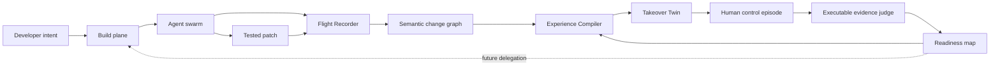

# PureFlow v0.3 — Dual-Control Development

- **Status:** R&D thesis, not an implemented product
- **Branch:** `codex/shadow-cockpit-rnd`
**Working category:** an autonomous AI IDE with a human readiness plane

## One sentence

PureFlow lets an agent swarm build at full speed while compiling the same work into small executable control experiences that keep the developer able to predict, change, debug, and recover their own system.

## The bet

AI code generation is not the feature to remove. It is the production engine.

The missing product is a second engine that maintains the human operator while the first engine maintains the software. Every meaningful agent run should be capable of producing three outputs:

1. a tested software change;
2. an executable `observe → actuate → recover` surface for a critical seam;
3. evidence that its human owner can take over that seam.

The control and readiness outputs are not summaries, diffs, quiz scores, or quotas of manually typed lines. They are drawn from the real change: predict behavior, choose a control point, diagnose from evidence, intervene, observe the result, and recover.

## The honest constraint

No IDE can guarantee deep understanding with zero human attention. Reading every generated line is also neither realistic nor a useful definition of engineering ownership.

PureFlow makes a stronger operational promise:

> Every generated line is accounted for: it is either linked to available intent and executable evidence through a supported semantic unit or explicitly marked unattributed. The developer's ability to take over critical project seams is repeatedly exercised and behaviorally verified.

If the developer skips all control experiences, the agents still finish the work, but PureFlow must not claim that readiness was preserved.

## Problem

Modern coding agents can acquire context, analyze it, choose a solution, implement it, run tests, debug failures, and repair the result. A developer may remain nominally “in the loop” while owning none of that loop.

The loss is not primarily typing speed or syntax recall. It is the disappearance of repeated closed-loop control:

```text
hypothesis → evidence → diagnosis → intervention → consequence → recovery
```

This creates four product failures:

- **False fluency:** explanations and readable diffs feel familiar without proving that the developer can reconstruct the mechanism.
- **Takeover shock:** the human is needed only for rare, ambiguous failures after routine practice has been automated away.
- **Unbounded review:** generated output grows faster than a person can attentively inspect it.
- **Broken apprenticeship:** a junior can ship increasingly complex systems without accumulating project-specific debugging and design experiences.

## User

The first user is an agent-native solo developer or small-team engineer who wants to ship a real SaaS, library, or application with maximum automation and also wants to remain capable without the agent.

They do not want:

- an anti-AI editor;
- a LeetCode detour;
- mandatory line-by-line review;
- a course overlaid on the IDE;
- surveillance or a score shown to a manager;
- a popup after every generated function.

They want the AI to do the volume work and spend a small, deliberate attention budget on the experiences that create the most project ownership.

## Product principles

1. **Autopilot stays on.** Production agents do not wait for a training step by default.
2. **Control beats observation.** A real prediction or intervention is more valuable than another explanation.
3. **Practice comes from live work.** Generic puzzles are not evidence of readiness for this repository.
4. **The judge is executable evidence.** Tests, traces, runtime behavior, and mutation outcomes outrank an LLM's opinion.
5. **Human effort is information-dense.** PureFlow selects a critical causal seam, not an arbitrary percentage of lines.
6. **Readiness is local.** Evidence belongs to a module, boundary, invariant, and time; there is no universal developer score.
7. **Assistance fades, not vanishes.** Hints adapt to evidence and expertise; syntax lookup is not treated as failure.
8. **No fake certainty.** A completed explanation or quiz never becomes a claim of operational skill.

## Core loop

### 1. Dispatch

The developer describes an outcome. One or more coding agents plan, edit, run commands, test, and repair in isolated worktrees.

### 2. Flight Recorder

PureFlow records a bounded local event stream: task intent, agent decisions that were made explicit, file changes, commands, test results, traces, and merge state. It does not require storing hidden model reasoning.

### 3. Compile

The Experience Compiler builds a semantic change graph and selects one high-information seam using:

- blast radius;
- novelty to this developer;
- architectural centrality;
- failure likelihood and ambiguity;
- weak or decayed readiness evidence;
- expected future takeover value;
- the user's current attention budget.

The Controllability Compiler attempts to bind that seam to an executable observation, a bounded actuator, and a recovery judge. The Operator Model Compiler then compares the new checkpoint with causal claims the developer previously demonstrated. Prompts are selected from model divergence, contradiction, or uncovered recovery routes—not from arbitrary changed functions.

### 4. Drive

While the production swarm continues, PureFlow opens a disposable **Takeover Twin** of that seam. The developer gets one short control episode without seeing the finished answer:

- predict a runtime effect;
- choose between real architectural levers;
- diagnose a symptom using tests, traces, or logs;
- repair a mutation derived from the current change;
- modify an adjacent behavior;
- recover after a deliberately wrong first intervention.

Control episodes have two classes:

- **Live steering:** for a high-leverage design fork, agents speculatively explore or implement alternatives in parallel. The developer predicts trade-offs and chooses the path that is actually integrated. Work continues on other branches while the decision is open; if the developer skips, the configured autonomous policy selects a path and no human-decision evidence is recorded.
- **Continuity rehearsal:** production integration does not wait. The developer operates on a fault, counterfactual, or adjacent change in the twin, and the result updates readiness evidence rather than the production patch.

This distinction prevents the product from becoming a simulated game. Some human decisions must genuinely steer the software, while lower-frequency recovery practice can stay entirely off the critical path.

### Decision Futures

Live steering uses a versioned **Decision Future**, not plan approval. When agents encounter a real high-leverage fork, they speculatively implement viable alternatives and continue unrelated work. PureFlow freezes the autonomous default, evidence catalog, and bounded integration deadline before asking the developer to predict a consequence, select a discriminating observation, or choose a path.

An on-time commitment can determine the integrated branch without requiring the developer to write its implementation. A skipped or late commitment leaves the autonomous policy in control; a late choice may still run as a counterfactual, but never receives retroactive live-influence credit. False forks, cosmetic alternatives, and post-reveal rubber stamps produce no decision evidence.

Decision Futures maintain a **Takeover Envelope** beside the agent Autonomy Envelope. The former lists critical seams with current human control and transfer evidence; the latter lists seams the agents can operate. PureFlow highlights their divergence rather than collapsing it into a developer score or restricting full agentic coding. ADR-009 defines the protocol, authority, timing, and falsifiers.

### 5. Judge

The episode runs against executable evidence. PureFlow records what the developer inspected, predicted, changed, and recovered. An LLM may coach after the attempt, but it is not the sole grader.

### 6. Refresh

A delayed, adjacent episode checks whether the developer can transfer the model after the original answer is no longer fresh. Only then may the relevant readiness evidence advance.

## The two planes



The build plane optimizes software throughput. The readiness plane optimizes takeover capability. They share evidence but do not share a critical path by default.

For a selected live architectural fork, final integration may wait for a bounded human choice while agents keep exploring both branches and continue unrelated work. This is a deliberate exception, not a global approval gate.

A recovery twin is compiled only after its source checkpoint has a stable target revision and passing evidence. Its parallelism is pipeline parallelism: the human operates on checkpoint N while agents execute checkpoint N+1 or another queued task. PureFlow must not claim that a post-checkpoint recovery episode ran concurrently with the unfinished change that generated it.

## Experience types

PureFlow schedules complete control loops, not random questions.

| Type | Human action | Evidence |
| --- | --- | --- |
| Predict | State expected behavior, affected invariant, or likely failure before reveal | Runtime result, trace, or test outcome |
| Steer | Select a causal lever and state the expected trade-off | Benchmark, constraint suite, or observed counterfactual |
| Diagnose | Request evidence and rank hypotheses from a symptom | Fault location and evidence path |
| Intervene | Make or direct the smallest safe change | Tests plus behavioral delta |
| Recover | Correct an unsuccessful intervention or injected fault | Restored behavior without regressions |
| Transfer | Solve a delayed adjacent case without the original answer | Independent task outcome |

An episode may contain several rows. Recognition alone never counts as takeover readiness.

## Readiness model

Readiness is stored locally as evidence attached to a project concept and scope:

```text
unseen → oriented → predicted → intervened → recovered → transferred
```

- `oriented` means the developer located the relevant path.
- `predicted` requires a pre-reveal prediction checked against behavior.
- `intervened` requires a valid causal change.
- `recovered` requires restoring a faulted or broken state.
- `transferred` requires a delayed adjacent task with bounded AI assistance.

States decay with time and meaningful code changes. The UI shows evidence and age, not a personality score or employment ranking.

## Line-level accountability

The Flight Recorder and Intent Ledger group generated lines into supported semantic units. Each unit may link to:

- the user intent or requirement it serves;
- the invariant or public behavior it changes;
- the agent action that introduced it;
- the tests, traces, benchmarks, or receipts that cover it;
- unresolved assumptions or evidence gaps.

Agent adapters cannot reliably infer an invariant or intent for every line from Git history alone. A build plane may emit structured claim IDs to improve attribution, but its own references begin as `claimed`. Only a deterministic structural join with allowed evidence can mark an attribution `supported`; contradictions, stale links, and unattributed units remain visible. Mechanical output may be covered by a reproducible generator receipt instead of thousands of fake decisions.

This is **evidence-carrying generation**, not proof of correctness. The Intent Ledger reconciles every changed line, makes a large patch navigable, and supplies raw material for the Experience Compiler; it does not pretend that a graph teaches the human by itself. The bidirectional flow is `committed intent → agent obligations → actual patch/evidence → intent delta`, so the system can expose when generated behavior drifted from the account rather than merely produce another summary.

The full decision, integrity rules, and falsifiable evaluation are specified in `docs/v0.3/ADR-008-EVIDENCE-CARRYING-GENERATION.md`. Like the Operator Model, it remains a post-R7 hypothesis.

## Operator Projection / Dual Source hypothesis

PureFlow will test whether an agentic project is easier to own when shown through two coupled views. **Software Source** is the complete executable repository and may be written almost entirely by agents. **Operator Source** is the product name for a compact, revision-bound `OperatorProjection` of human-committed intent, decisions, invariants, observations, control handles, and recovery policies for critical seams.

Operator Source is not a DSL, generated architecture document, separate mutable database, or second evidence authority. A pure compiler derives it from immutable commitment events, the Intent Ledger, Operator Model, Decision Future evidence, and the sole `VerifiedReadiness` derivation. Agent-generated nodes remain proposals. Pre-reveal commitment and executable evidence create only bounded claims; code and evidence changes deterministically derive affected projections as stale or contradicted.

The bidirectional compiler therefore produces two deltas after a checkpoint:

- a total Software Source account for every generated line;
- an Operator Delta showing which human commitments and bounded-control claims remain supported, became stale, were contradicted, or now leave a critical seam uncovered.

This may give the developer a human-scale project view without asking them to maintain a specification language or read every physical line. ADR-010 defines the one-way event algebra, laws, prior-art boundary, and matched representation ablation. “Dual Source” remains a proposed category hypothesis until that ablation improves executable causal orientation over the existing views.

## Executable Operator Model

PureFlow maintains a second, local versioned view beside the program: the causal claims the developer has actually demonstrated for this project.

It is not an AI-generated repository summary. A claim can become fresh only through a pre-reveal prediction, evidence choice, intervention, recovery, or delayed transfer bound to executable evidence. Claims become stale when their semantic unit or control surface changes and contradicted when observed behavior disproves the committed prediction. Unknown and unattributed areas remain visible gaps.

This gives the IDE a concrete answer to “what should the developer think about while agents keep coding?” It chooses the smallest action that reduces divergence between the running software and the operator's demonstrated model. A successful action should create a control dividend such as a regression probe, observation recipe, rollback path, or reusable recovery handle.

The Operator Model is specified in `docs/v0.3/ADR-007-EXECUTABLE-OPERATOR-MODEL.md`. Decision Futures and the Takeover Envelope are specified in `docs/v0.3/ADR-009-DECISION-FUTURES.md`. ADR-010 proposes an optional human-facing projection over them, not another authority. All remain post-R7 hypotheses until the complete expert gate and human experiments pass.

## Autonomy Router

The developer selects a cognitive budget such as `0`, `5`, or `15` minutes per work session. The router uses that budget to decide what becomes a human control episode while agents perform the remaining work.

Examples:

- boilerplate, formatting, fixture generation, mechanical refactors, and already-mastered seams stay fully autonomous;
- a new authorization boundary may produce a prediction plus fault-recovery episode;
- a high-impact architecture fork may launch speculative alternatives and let the developer choose the production path from executable trade-off evidence;
- a senior with strong evidence in that boundary receives no beginner exercise, but may receive an architectural counterfactual;
- a skipped episode never blocks a normal merge unless the user explicitly configures a high-risk team policy.

This router is the feedback link between learning evidence and future agent delegation. Without it, the product is a training sidebar next to an unrelated IDE.

## Primary user experience

1. The developer asks PureFlow to implement a feature exactly as they would ask Cursor, Claude Code, or Codex.
2. The agent swarm starts immediately. The developer chooses a small attention budget or leaves it at their default.
3. PureFlow shows a compact cockpit: running agents, changed behaviors, evidence gaps, and one available takeover episode.
4. The developer enters a disposable twin while agents keep working. The finished implementation is hidden until the attempt ends.
5. They predict, inspect evidence, intervene, and run the result. Hints are available but reduce the strength of the evidence rather than “failing” the user.
6. PureFlow compares the episode with real behavior, explains the mismatch, and links back to the production change.
7. The production patch can merge normally. Later, PureFlow offers a short adjacent takeover to test transfer.

The interaction should feel like driving a simulator built from today's route while the autonomous vehicle continues the trip—not like completing homework before the car starts.

## Control Pulses during agent work

PureFlow turns useful agent progress updates into optional, event-driven **Control Pulses**. The agent does not expose private chain-of-thought and does not stop on a timer. At a stable checkpoint it publishes a compact observable capsule: intent, changed behavior, owning boundary, claimed invariant, evidence, and one unresolved assumption.

The Experience Compiler selects a seam from a high-value eligible set and may randomize within that set. It never samples an arbitrary function from the repository. The developer receives one short prompt such as:

- predict the output for a concrete input before the implementation is revealed;
- name the failure that would falsify the claimed invariant;
- choose which trace or test would distinguish two hypotheses;
- justify a boundary against one plausible alternative;
- direct a cold agent with a hypothesis, expected observation, and two conditional next actions.

The first protocol is **Explain-to-Break**: a bounded Side Coach converts the developer's answer into a candidate falsifier, the compiler validates it, and the Takeover Twin executes it. The small model may parse and coach; only executable evidence can adjudicate the claim. The production agent continues with the next checkpoint or unrelated work. Skipping creates no readiness evidence but does not stop delivery.

### Motivation without fake ownership

The later product may include a local Flight Log:

- a weekly continuity streak for completing at least one evidence-backed control episode;
- rare achievements for catching a false agent claim, recovering after a wrong hypothesis, directing a cold agent, proving rollback, or passing delayed transfer;
- a scoped visual map of fresh and stale takeover evidence.

PureFlow will not award points for manually typed lines, commits, time in the editor, or the number of questions answered. It will not publish a leaderboard of developer “understanding.” Those proxies reward typing, easy-task farming, and surveillance rather than maximum automation plus real control. Optional community recognition may rank validated scenario contributions, not people.

## MVP

The first experiment is deliberately narrower than a new Cursor clone.

### Supported environment

- existing VSCodium distribution and native editor surfaces;
- local Git repository;
- TypeScript/Node projects with a deterministic test command;
- one agent adapter initially, with a stable interface for Claude Code, Codex, OpenCode, or another harness;
- local worktrees and disposable processes/containers;
- no cloud account required for the readiness plane.

### One end-to-end capability

For a completed agent patch that changes tested behavior:

1. capture the patch, commands, and test evidence;
2. identify one changed function or boundary covered by a test;
3. create a disposable twin at the relevant revision;
4. apply a known mutation or counterfactual tied to that change;
5. present the failing behavior without revealing the fix;
6. let the developer diagnose and repair it;
7. judge with the real test suite;
8. store local, scoped evidence;
9. schedule one delayed adjacent case.

The MVP does not need autonomous architecture grading, a universal semantic graph, a multi-agent marketplace, or a deep VSCodium fork.

## Build-versus-fork decision

PureFlow should not reimplement file editing, terminals, worktrees, shell execution, model routing, or generic agent loops before the human-control mechanism is validated.

The R&D architecture is:

- VSCodium plus a bundled extension for the product surface;
- adapters over existing coding-agent runtimes for the build plane;
- PureFlow-owned Flight Recorder, Intent Ledger, Controllability and Experience Compilers, Decision Futures, Executable Operator Model, Takeover Envelope, Takeover Twin, Evidence Judge, Readiness Map, Autonomy Router, and—only if H9 passes—a pure Operator Projection Compiler.

This keeps the differentiating layer portable and avoids tying the thesis to a commercial editor fork. A deeper editor fork is justified only if a validated control experience requires unsupported workbench primitives.

## What this is not

- Claude Learning mode with more questions;
- a comprehension gate that pauses generation;
- Buggr embedded in an IDE;
- a code tour or automatically generated documentation;
- a fixed quota of hand-written code;
- an anti-cheating or employee-monitoring tool;
- a claim that tests prove total correctness;
- a guarantee of skill retention before a longitudinal experiment.

## Metrics

### North-star outcome

**Delayed AI-off adjacent-task success**: after the generated solution is no longer fresh, can the developer diagnose and safely change a neighboring behavior without an agent providing the answer?

### Supporting outcomes

- time to first valid hypothesis;
- fault-localization accuracy;
- evidence-selection quality;
- first-intervention and recovery success;
- calibration between confidence and observed performance;
- hint dependency;
- critical-path production time;
- human attention minutes per shipped change;
- episode completion and voluntary opt-out rates;
- scenario compilation success and deterministic judge reliability.

### R&D gates, not marketing claims

Initial targets are hypotheses to test:

- at least 80% of supported, test-backed patches produce a valid episode automatically;
- judge results agree with an expert-labeled oracle on at least 90% of pilot episodes;
- median production critical-path slowdown remains at or below 5%;
- median active human budget remains at or below 10 minutes per meaningful change;
- delayed adjacent-task success improves by at least 20 percentage points over normal agent use in a powered study.

Until those gates are tested, PureFlow must describe them as targets, never measured outcomes.

## Risks

| Risk | Consequence | Mitigation or falsifier |
| --- | --- | --- |
| Generated episodes are trivia | High completion, no transfer | Require causal action plus delayed adjacent tasks |
| Agent-written tests encode the same mistake | False evidence | Reuse existing tests, invariants, differential behavior, and human-authored oracles where possible |
| Mutations teach a pattern library | Gaming rather than understanding | Vary failure families and test transfer on unseen adjacent cases |
| The experience is annoying | Users set the budget to zero | Keep it off the critical path, adaptive, short, and skippable |
| Semantic compilation is unreliable | Wrong seam or incoherent scenario | Start with test-backed changed boundaries and narrow stack support |
| Readiness becomes surveillance | Loss of trust and misuse | Local, project-scoped evidence; no manager leaderboard; explicit export only |
| Strong developers receive toy tasks | Product is dismissed | Expertise-sensitive scenarios and architectural counterfactuals |
| The effect is only immediate recall | No real skill preservation | Delayed AI-off transfer is the required outcome |

## Release gates

1. **Mechanism gate:** a controlled pilot shows better delayed takeover than diff/explanation/question baselines.
2. **Technical gate:** the compiler creates valid, reproducible episodes for the supported stack without hand-authoring each one.
3. **Experience gate:** developers voluntarily complete episodes without material production slowdown.
4. **Expansion gate:** only after the above should PureFlow add more languages, agent engines, team policy, or cloud execution.

## Open questions

- Is a mutation-based recovery episode enough, or must prediction and architectural steering always precede it?
- Which semantic seams best predict future takeover value?
- How much delayed spacing is useful: hours, days, or after the next related change?
- Can a safe local twin be produced for distributed systems without recreating the entire environment?
- Should readiness influence only practice selection, or also suggest that a human lead a real high-risk change?
- Which agent event APIs expose enough evidence without depending on hidden reasoning traces?

The answers belong in experiments, not marketing copy.
