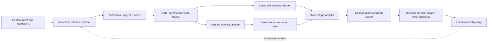
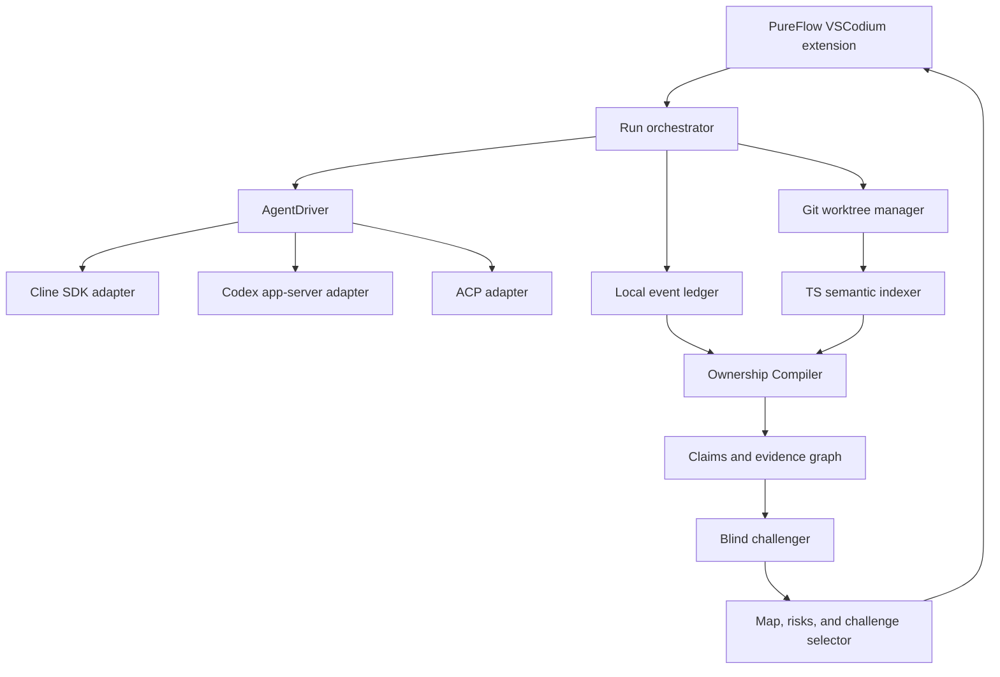

# PureFlow v0.2 — Ownership Compiler

- **Status:** Product and R&D proposal
- **Branch:** `codex/v0.2-ownership-compiler`
- **Date:** 2026-07-25
- **Decision owner:** yava-code
- **Document authority:** This PRD defines the proposed v0.2 direction. PureFlow v0.1 remains a released, historical implementation until the v0.2 hypotheses pass the gates in this document.

## Executive decision

PureFlow will not fight vibe coding, require developers to type generated code, or pretend that reviewing a 2,000-line AI diff preserves engineering skill. It will maximize autonomous agent execution and add a separate, sparse loop that keeps the human's model of the system current.

The product thesis is:

> Agents write the system. The developer remains able to predict it, challenge it, debug it, and take over.

The architectural decision is equally direct:

- keep the upstream-compatible VSCodium distribution and native IDE surfaces;
- reuse an open agent runtime behind a PureFlow-owned `AgentDriver` boundary;
- own the event ledger, semantic change model, evidence graph, challenge selection, and ownership history;
- do not build a file editor, terminal agent, checkpoint engine, or swarm scheduler from zero unless an integration spike proves a required event cannot be obtained safely;
- do not maintain a deep editor fork.

The initial default runtime candidate is the Cline SDK. ACP is the compatibility boundary for other agents, with Codex app-server as the first direct secondary adapter. This is a proposed technical choice, not a permanent dependency: the spike in [the runtime ADR](docs/v0.2/ADR-001-agent-runtime.md) must prove event provenance, cancellation, isolation, and patch/test capture before adoption.

## The calculator analogy

A calculator is useful because it removes mechanical work. It becomes harmful only when a person can no longer estimate whether the answer is plausible, choose the correct operation, or notice that the wrong quantity was entered.

AI coding agents are the calculator for implementation. Asking developers to stop using them is irrational. Asking them to inspect every generated line recreates the mechanical work and collapses at agent scale. PureFlow therefore protects the higher-order abilities that make automation useful:

1. frame the real problem and constraints;
2. recognize the system boundary that should change;
3. predict behavior and failure modes;
4. evaluate architectural trade-offs;
5. locate the source of a failure;
6. direct a fresh agent without depending on the original agent's hidden context;
7. know where one's mental model is stale.

Typing syntax is not the north star. Operational ownership is.

## Problem

### What changed

Agentic coding has moved the bottleneck from producing code to maintaining a trustworthy model of rapidly changing systems. A developer can now request a feature, let several agents edit and test it, and receive thousands of changed lines before they have reconstructed the architecture.

Common responses do not solve this:

- **“Read the diff.”** This assumes attention scales linearly with autonomous output. It does not.
- **“The AI writes, the human reviews.”** In practice, the reviewer often sees more generated code than they can deeply inspect, and the review agent may share the implementer's blind spots.
- **“Use plan mode.”** A generated plan is still a passive artifact and can be approved without comprehension.
- **“Ask the AI to explain.”** A fluent explanation can be wrong, incomplete, or uncalibrated to the reader.
- **“Practice LeetCode without AI.”** This trains a different task from owning an agent-built SaaS, service, or production system.
- **“Force manual contributions.”** This throws away automation speed and drives users to disable the product.

### User pain

The primary user likes building with agents and does not want to go back. They also notice that:

- a new task begins with “I do not know where to start”;
- the repository changes faster than their architecture model;
- they accept code because checks are green, not because behavior is understood;
- debugging becomes repeated prompting instead of hypothesis formation;
- they cannot brief another engineer or a cold agent without replaying the original chat;
- they feel productive today but less capable of intervening tomorrow.

### Why existing PureFlow v0.1 is not enough

v0.1 is a technically useful VSCodium foundation, but its product core assumes that AI waits to be asked and that optional no-AI Focus Reps restore ownership. The clarified goal is different: AI should execute aggressively, while PureFlow preserves system understanding without demanding manual implementation.

The v0.2 branch therefore freezes v0.1 as a released experiment, preserves reusable infrastructure, and replaces the manual-practice core with an ownership control plane.

## Product promise

### One sentence

PureFlow is an agentic development environment that lets agents write almost everything while continuously compiling their work into a verifiable mental model the developer can still use.

### Tagline

**Agents write the code. You keep the system.**

### What “understand” means

PureFlow must not infer understanding from time spent, keystrokes, answer length, a self-rating, or whether the user opened a diff. For this product, understanding is the demonstrated ability to perform one or more concrete operations on the current system:

- predict the outcome of a relevant input or failure;
- locate the boundary responsible for that outcome;
- explain an invariant with code, test, or runtime evidence;
- choose between a real trade-off and name the consequence;
- direct a fresh agent through an adjacent change;
- diagnose a controlled failure without the builder agent's rationale.

These are task-specific signals, not a global intelligence or developer score.

## Goals

### User goals

1. Ship real features at agent speed without reading the entire generated diff.
2. See what changed at the level of behavior, modules, interfaces, state, and invariants.
3. Spend at most a small, adaptive cognition budget on the highest-information parts of a change.
4. Be able to recover when the primary agent is wrong or unavailable.
5. Accumulate a local map of owned, uncertain, and stale areas without surveillance.

### Product goals

1. Complete the implementation loop autonomously in an isolated worktree.
2. Produce evidence-backed change claims from agent events plus deterministic code/test/runtime signals.
3. Select one to three high-value ownership checks rather than quiz every change.
4. Measure delayed takeover ability and delivery overhead, not typing purity.
5. Remain useful when the user skips every challenge.
6. Support multiple agent runtimes without making their UI or protocol the product moat.

### Business and distribution goals

1. Validate the core interaction first as an open Agent Skill for Claude Code and Codex.
2. Convert proven mechanics into the PureFlow IDE, where SCM, language services, tests, debugger events, and history provide stronger evidence.
3. Build a recognizable category around “ownership-preserving agentic development,” not anti-AI education.

## Non-goals

- Proving authorship or detecting how much code was written by AI.
- Blocking copy/paste, other agents, network access, or merges.
- Requiring the developer to retype boilerplate or solve unrelated exercises.
- Replacing native editor, terminal, debugger, Git, and test surfaces.
- Grading employees or publishing an individual skill score.
- Treating an LLM summary as evidence.
- Claiming causal skill improvement before a controlled study supports it.
- Building a general-purpose model provider, editor core, shell, patch engine, or Git implementation.
- Making Monad or onchain attestations part of the v0.2 core. The v0.1 Monad vertical remains optional and historically intact.

## Users and jobs

### Primary: agent-native builder

An indie hacker, junior developer, or product engineer builds a SaaS with one or more agents. They value speed, work across unfamiliar stacks, and want confidence that they can still reason about the product when it fails.

**Job:** “Build this for me, but leave me able to operate and change it tomorrow.”

### Secondary: senior engineer with agent throughput

A senior engineer delegates implementation but is overwhelmed by review volume and agent-generated rationale.

**Job:** “Compress ten agent-hours into the decisions, invariants, evidence, and risks I actually need to own.”

### Secondary: team lead

A lead wants fast delivery without turning engineering review into a rubber stamp or installing employee surveillance.

**Job:** “Show which architectural claims are evidenced and which areas have no human owner, without ranking people.”

## Product principles

1. **Autonomy first.** Let the agent finish ordinary implementation and verification without educational interruptions.
2. **Human in the model loop, not the keystroke loop.** Human attention is spent on intent, invariants, boundaries, risk, prediction, and takeover.
3. **Evidence before explanation.** AST/LSP edges, tests, traces, schemas, Git objects, and tool events anchor every material claim.
4. **Predict before reveal.** A short counterfactual exposes the user's current model better than asking “Do you understand?”
5. **Sample by information value.** Challenge risky or surprising seams, not every file.
6. **Independent challenge.** The reviewer does not inherit the builder's private rationale and must reconstruct claims from the repository and evidence.
7. **Voluntary and useful when skipped.** Challenges can be skipped; maps and evidence still improve delivery.
8. **No score theater.** Show concrete owned/stale areas and dated evidence, never a universal developer score.
9. **Local by default.** Prompts, answers, code maps, and ownership history stay local unless the user explicitly exports them.
10. **Raw diff is an escape hatch.** It remains available, but it is not the main comprehension surface.

## The dual loop



The upper loop maximizes delivery. The lower loop compresses that delivery into a usable human model. The lower loop must never silently slow or block the upper loop.

## End-to-end experience

### 1. Intent

The developer asks for a normal task in natural language. PureFlow automatically proposes a Mission Contract containing:

- desired outcome;
- acceptance evidence;
- constraints already present in the repository;
- unknowns and assumptions;
- hard-to-reverse decisions;
- risk level;
- explicit kill or rollback condition.

The developer is interrupted only for an ambiguous decision whose consequences are expensive to reverse. They may delegate even that decision.

### 2. Autonomous build

The runtime works in an isolated Git worktree, reads and edits files, runs tests, invokes subagents, and iterates until the task succeeds, fails honestly, or reaches its budget. PureFlow captures tool and change provenance without requiring the developer to watch.

### 3. Ownership compilation

After the run, PureFlow produces three to seven `ChangeClaim` records. Each record says:

- what behavior changed;
- which boundary, symbol, schema, or state transition implements it;
- which invariant was introduced or preserved;
- what executable or structural evidence supports the claim;
- what remains uncertain;
- how to roll back or disable the change.

The LLM writes the human explanation. It may not invent the anchors.

### 4. Independent challenge

A fresh challenger receives the Mission Contract, base/head repository states, deterministic semantic delta, and test evidence, but not the implementer's hidden chain of thought or post-hoc rationale. It looks for:

- claims with no evidence;
- changed behavior not represented by a claim;
- tests that pass without exercising the claim;
- architecture drift;
- new failure paths;
- disagreement between code, docs, schema, and runtime traces.

### 5. Human handoff

The default handoff is designed for roughly 90 seconds:

1. scan the Change Map;
2. inspect the highest-risk claim and its evidence;
3. answer one prediction or boundary question before seeing the answer;
4. optionally ask a cold agent to perform an adjacent change using the developer's brief.

The user can skip the entire handoff. Skipping creates a dated “unconfirmed” area, not a penalty.

### 6. Delayed ownership

For consequential changes, PureFlow may offer a 24-hour revisit: one different counterfactual, generated from the current repository rather than from a generic question bank. This is optional and local.

## Core features

### P0 — Automatic Mission Contract

Turn a vague prompt into an editable task model without making the developer write a formal specification. Surface only assumptions that materially change architecture, data, security, cost, or rollback.

**Automation that improves understanding:** the system finds and frames the decision; the human sees the consequence rather than performing clerical planning.

### P0 — AgentDriver and isolated runs

Provide a runtime-neutral interface for start, stream, cancel, resume, approve exceptional risk, and collect artifacts. Default runs use disposable or retained worktrees and never mutate the main checkout silently.

### P0 — Event and evidence ledger

Record normalized, local events:

- agent and parent task;
- tool name and timestamp;
- command exit status;
- files and symbols touched;
- test identifiers and results;
- base/head commits;
- declared decision and alternative when available;
- link from a claim to its structural or executable evidence.

Do not record secrets, full terminal history by default, or hidden model reasoning.

### P0 — Semantic Change Map

Show architecture delta instead of line volume:

- modules and dependency edges added or removed;
- public interfaces and schemas changed;
- callers and callees affected;
- state transitions and persistence boundaries;
- tests associated with the changed behavior;
- runtime or deployment surface affected.

The first implementation supports TypeScript. More languages follow only after the TypeScript graph is deterministic and tested.

### P0 — Evidence-backed Change Claims

Generate a compact claim set, reject unsupported claims, and make uncertainty visible. Clicking an anchor opens the native editor, test output, or trace at the relevant location.

### P0 — Risk Router

Rank candidate handoff seams using change impact, novelty, uncertainty, missing evidence, security/data boundaries, and divergence from the user's recorded model. This rank chooses what to ask; it never becomes a user score.

### P0 — Predict before reveal

Ask one concrete, task-specific counterfactual such as:

> If the cache write succeeds but invalidation fails, which request path returns stale data and what evidence would reveal it?

The question must be answerable from the compiled change model and must have an evidence-backed adjudication. “Explain the code” is not sufficient.

### P1 — Takeover Simulator

Create a safe mutation in a sandbox or retained worktree: invert an invariant, remove a registration edge, change a schema assumption, or simulate a dependency failure. The developer does not need to write code; they identify the failure boundary and direct an agent to recover it.

### P1 — Cold-agent handoff

Start a new agent without the builder transcript. The developer briefs it using their own model. Success is measured by whether the fresh agent can complete or correctly plan an adjacent change with repository evidence.

### P1 — Decision Replay

Show where the implementation diverged from the initial Mission Contract, what evidence triggered the change, and which alternative was rejected. The developer can rewind to the decision, not just the file diff.

### P1 — Invariant Radar

Extract candidate invariants from tests, types, schemas, assertions, and runtime checks. Highlight an invariant only when an anchor exists. Let the developer confirm, edit, or reject it.

### P1 — Architecture Drift Watch

Compare the actual dependency and public-contract delta against established boundaries. Automatically suggest simplification when the agent creates a new abstraction, dependency, or parallel implementation without evidence that it is needed.

### P1 — Slop Sweeper

Run a post-build simplifier agent constrained by the Mission Contract and behavior tests. It looks for duplicated helpers, speculative abstractions, dead compatibility layers, swallowed errors, and generated prose comments. Every deletion must preserve evidence and pass tests.

This feature automates code cleanup while the Change Map tells the developer which concepts remain.

### P1 — Claim-to-test generation

When a claim lacks executable evidence, generate or strengthen a test that targets the claim. Label generated evidence separately from independently observed runtime evidence.

### P2 — Ownership Map

Maintain a local, dated map of modules and system boundaries:

- confirmed through prediction, diagnosis, or handoff;
- changed since confirmation;
- unconfirmed because the handoff was skipped;
- stale because dependencies or contracts moved.

Never reduce this map to a single score.

### P2 — Adaptive cognition budget

Offer three user-controlled modes:

| Mode | Agent execution | Human loop |
| --- | --- | --- |
| Autopilot | Fully autonomous | Change Map only; no questions |
| Ownership | Fully autonomous | One to three risk-weighted checks after the run |
| Deep takeover | Fully autonomous | Sandbox fault, cold-agent handoff, and delayed revisit |

The system may recommend a mode based on risk, but the user chooses.

### P2 — Team evidence policies

Allow teams to require evidence coverage for high-risk claims or an independent challenger result. Do not require a personal quiz, store private answers centrally, or rank developers.

### P2 — Incident backfill

When production fails, reconstruct which claim or invariant was missing, update the ownership map, and generate a future challenge from the real incident. This turns actual work into practice without a synthetic exercise catalog.

## IDE information architecture

PureFlow remains sidebar-first and native-IDE-first. The proposed v0.2 routes are:

1. **Run** — task, Mission Contract, agents, budgets, current evidence, and exceptional approvals.
2. **Map** — semantic architecture and behavior delta.
3. **Claims** — evidence-backed behavior, invariants, uncertainty, and rollback.
4. **Risks** — challenger disagreements, missing evidence, drift, and unconfirmed seams.
5. **Ownership** — local history, optional handoffs, and stale areas.

The route count may be reduced after usability testing. No route opens a mandatory full-page training webview. Native editor, terminal, tests, debugger, Source Control, and diff remain first-class destinations.

## System architecture



### AgentDriver contract

The first spike should support the following conceptual boundary:

```ts
interface AgentDriver {
  start(input: MissionContract, workspace: WorktreeRef): Promise<RunRef>;
  events(run: RunRef, signal?: AbortSignal): AsyncIterable<AgentEvent>;
  respond(run: RunRef, input: AgentInput): Promise<void>;
  cancel(run: RunRef): Promise<void>;
  snapshot(run: RunRef): Promise<RunSnapshot>;
}
```

PureFlow owns normalized events and domain entities. Provider-specific message types must not leak into the Ownership Compiler.

### Core entities

| Entity | Purpose |
| --- | --- |
| `MissionContract` | Outcome, acceptance evidence, constraints, assumptions, risk, rollback |
| `TaskRun` | Base/head, worktree, runtime, agents, budget, status |
| `AgentEvent` | Normalized tool, file, symbol, command, test, and decision event |
| `SemanticDelta` | Deterministic module, symbol, dependency, contract, and state changes |
| `ChangeClaim` | Before/after behavior, invariant, anchors, uncertainty, rollback |
| `EvidenceAnchor` | Symbol, test result, trace, schema edge, Git object, or tool event |
| `ReviewFinding` | Independent disagreement, severity, evidence, resolution |
| `OwnershipCheck` | Prediction, locate, diagnose, decide, or cold-agent handoff |
| `OwnershipEvent` | Dated local result and which repository state it applies to |

### Source-of-truth hierarchy

1. executable runtime observation or test result;
2. compiler/type/language-service result;
3. deterministic AST or dependency graph;
4. Git object and normalized tool provenance;
5. repository documentation;
6. LLM explanation.

An LLM may synthesize lower levels. It may not silently promote its own statement above them.

## Runtime build-versus-reuse decision

| Option | Decision | Reason |
| --- | --- | --- |
| Build a full agent runtime | Reject for v0.2 | File editing, shell orchestration, checkpoints, approvals, MCP, model routing, and retries are mature commodity surfaces |
| Fork Cursor, Windsurf, or Kiro | Reject | Closed product layers are not a maintainable open substrate |
| Deep-fork Code OSS/VSCodium | Reject | Creates continuous editor/Electron/updater/security maintenance without improving the core mechanism |
| Fork a complete open agent extension | Avoid | Couples provider UI, runtime, and PureFlow UX; makes upstream updates expensive |
| Reuse a headless SDK behind `AgentDriver` | Adopt if spike passes | Preserves velocity and event access while PureFlow owns its differentiating data model |
| ACP compatibility adapter | Adopt incrementally | Reduces lock-in and allows external agents where event quality is sufficient |
| Fork only a thin runtime layer | Contingency | Allowed only if a required provenance or control event cannot be exposed upstream |

See [ADR-001](docs/v0.2/ADR-001-agent-runtime.md) for the acceptance gate and trade-offs.

## Privacy, trust, and safety

- Keep event ledger, semantic graph, challenge answers, and ownership history local by default.
- Redact secrets and absolute personal paths before any configured remote model call.
- Store credentials only in SecretStorage or environment variables.
- Separate model-visible rationale from retained evidence; never store hidden chain of thought.
- Run agents in explicit worktrees with clear base/head and cancellation.
- Require normal user approval for destructive, privileged, financial, deployment, or credential-sensitive actions.
- Treat external skill/plugin repositories as code: show their source and permissions before installation.
- Export only user-selected claims or aggregate experiment data.

## Success metrics

The numbers below are **design targets and experiment thresholds, not measured PureFlow results**.

### North-star outcome

**Delayed takeover success:** 24 hours after an agent-built change, can the developer predict a relevant failure, locate the responsible boundary, and direct a fresh agent through an adjacent change without reading the full diff?

### Product metrics

| Metric | Definition | Initial target |
| --- | --- | --- |
| Autonomous task success | Task meets repository acceptance evidence without manual coding | No regression versus the same runtime without PureFlow |
| Handoff overhead | Active human time added after a successful run | Median <= 90 seconds in Ownership mode |
| Delivery overhead | End-to-end wall-clock delta versus baseline runtime | Median <= 10% |
| Evidence coverage | Material claims with at least one structural or executable anchor | >= 95% |
| Unsupported-claim catch rate | Planted false/unsupported claims caught by challenger | >= 80% in the TypeScript pilot |
| 24-hour prediction accuracy | Correct outcome and reason on a task-specific counterfactual | +20 percentage points versus passive AI summary in exploratory study |
| Boundary localization | Finds responsible module/interface in a controlled failure | >= 70% within five minutes |
| Cold-agent handoff success | Fresh agent reaches a correct adjacent plan from human brief plus repo | +20 percentage points versus no handoff protocol |
| Calibration error | Gap between confidence and demonstrated result | Decreases versus baseline; no universal score shown |
| Challenge acceptance | Offered handoffs voluntarily completed | >= 35% after four weeks; never a merge gate |
| Skip cost | Extra interaction when user chooses Autopilot/skip | <= one click and no repeated nagging |

Targets should be revised after pilot variance is known. A missed learning target with acceptable delivery is a product hypothesis failure, not permission to invent a better metric.

### Guardrail metrics

- no increase in accidental destructive actions;
- no silent main-checkout edits;
- no challenge based solely on LLM-created facts;
- no personal ranking or employer-facing answer transcript by default;
- no more than three interruptions per ordinary task in Ownership mode;
- no retention claim based only on an immediate quiz.

## Research basis

These studies motivate the problem; they do not prove that PureFlow's proposed mechanism works.

1. [Anthropic, “How AI assistance impacts the formation of coding skills” (2026)](https://www.anthropic.com/research/AI-assistance-coding-skills) reports a randomized study with 52 mostly junior developers learning Trio. The AI group averaged 50% versus 67% on the immediate quiz, with the largest gap in debugging. Generation-then-comprehension and hybrid code-explanation patterns were associated with higher scores, but the interaction-pattern analysis was qualitative, the sample was small, and long-term retention was not measured.
2. [Anthropic, “Agentic coding and persistent returns to expertise” (2026)](https://www.anthropic.com/research/claude-code-expertise) analyzes roughly 400,000 Claude Code sessions. Its classifiers attribute about 70% of planning decisions to people and about 80% of execution decisions to Claude; task-specific expertise is associated with higher success and better recovery. This is observational and classifier-derived, not causal proof.
3. [Microsoft Research, CHI 2025 critical-thinking survey](https://www.microsoft.com/en-us/research/publication/the-impact-of-generative-ai-on-critical-thinking-self-reported-reductions-in-cognitive-effort-and-confidence-effects-from-a-survey-of-knowledge-workers/) surveyed 319 knowledge workers across 936 examples. Higher confidence in GenAI was associated with less reported critical thinking, while the work shifted toward verification, integration, and stewardship. The data is self-reported and correlational.
4. [METR's early-2025 developer productivity RCT](https://metr.org/blog/2025-07-10-early-2025-ai-experienced-os-dev-study/) found 16 experienced open-source developers took 19% longer with the tested early-2025 tools while believing they were faster. The setting and models are narrow and dated; the relevant lesson is that perceived productivity and measured outcomes can diverge.

The product hypothesis derived from this evidence is narrower than “AI makes developers worse”:

> Agent automation can remain maximal if the product turns a small amount of human attention into evidence-backed prediction, diagnosis, and direction rather than passive explanation or manual reimplementation.

That hypothesis still requires testing.

## Validation design

### Conditions

Compare the same autonomous runtime under three handoff conditions:

1. **Baseline agent:** normal completion message and raw diff access.
2. **Passive summary:** AI-generated change explanation with no prediction.
3. **PureFlow:** deterministic semantic delta, evidence-backed claims, one risk-weighted prediction, and optional cold-agent handoff.

### Tasks

- a new TypeScript feature across multiple modules;
- a state or cache bug with a non-obvious invariant;
- a schema/API evolution task;
- a controlled production-like failure introduced after completion;
- an adjacent change performed 24 hours later.

### Measurements

- successful delivery and wall-clock time;
- active human attention time;
- immediate and 24-hour prediction accuracy;
- failure-boundary localization time;
- quality of instructions to a fresh agent;
- unnecessary code opened or diff lines inspected;
- confidence before and after evidence;
- opt-out and annoyance rate.

### Study stages

1. **Mechanism smoke test:** 8–12 users; discover broken UX and impossible metrics.
2. **Exploratory crossover:** 30–50 users; estimate effect sizes and variance.
3. **Confirmatory study:** preregistered design and sample size based on exploratory variance.

No marketing claim should say the product preserves or improves skill until delayed measures beat the passive-summary condition with acceptable delivery overhead.

## Release plan

### Phase 0 — Public skill wedge

Ship `ai-will-challenge-you` for Claude Code and Codex. It cannot produce deterministic IDE graphs, but it can validate:

- autonomy-first wording;
- compact Change Model format;
- predict-before-reveal interaction;
- voluntary modes;
- developer tolerance for a 90-second handoff.

### Phase 1 — Executable TypeScript vertical slice

One agent completes one TypeScript task in a worktree. PureFlow captures events, builds a base/head semantic delta, emits three to seven anchored claims, runs a blind challenger, and presents one optional prediction.

Acceptance:

- no manual code required;
- no need to read the full diff;
- every material claim has an anchor;
- planted unsupported claims are surfaced;
- graph edges come from the TypeScript program, not an LLM;
- the user can skip every question;
- raw diff remains available;
- extension checks and fixture tests pass.

### Phase 2 — Takeover proof

Add sandbox fault injection, cold-agent handoff, delayed revisit, and a local ownership map. Run the exploratory crossover study.

### Phase 3 — Multi-runtime and team evidence

Add Codex app-server and ACP adapters, evidence policies for high-risk claims, CI/PR exports, and language support selected by measured demand.

### Phase 4 — Productization

Signed cross-platform builds, resilient migrations, privacy review, onboarding, local-model options, and a public evidence-based case study.

The detailed experiments and sequencing live in [the R&D plan](docs/v0.2/RND_PLAN.md).

## Risks and kill criteria

| Risk | Mitigation | Kill or pivot signal |
| --- | --- | --- |
| Challenges feel like homework | Post-run only, risk-weighted, voluntary, <= 90 seconds | Majority disables after first week or median overhead > 10% |
| LLM fabricates architecture | Deterministic graph and explicit evidence hierarchy | Material unsupported-claim rate remains > 10% after hardening |
| Same AI grades itself | Blind challenger with separated context and executable anchors | Challenger adds prose but does not improve planted-fault detection |
| Runtime integration becomes the product | Strict `AgentDriver`; upstream contributions; thin contingency fork | > 50% engineering time spent chasing provider UI/protocol churn |
| Ownership metric becomes surveillance | Local-only event model; no global score; team policies cover claims, not people | Enterprise demand requires hidden monitoring or personal ranking |
| Users want only zero-friction automation | Autopilot remains valuable via maps and claims | PureFlow mode has no retention/takeover benefit over passive summary |
| Semantic graph cannot represent behavior | Combine static edges with tests and traces; limit supported task classes | Users still need raw diff for most evaluated tasks |
| Public skill overpromises the IDE | Label skill as protocol preview | Users consistently mistake prompt behavior for verified evidence |

## Open questions

1. Is “PureFlow” the final brand, or should the ownership compiler become a separate product under the `ai-will-challenge-you` identity?
2. Should the default mode be Autopilot for adoption or Ownership for clearer differentiation?
3. What is the smallest independent reviewer separation that meaningfully reduces shared blind spots: different context, different model, or different provider?
4. Which TypeScript evidence is sufficient for v1: compiler graph plus tests, or are runtime traces required?
5. Should ownership history be repository-local, user-global, or both with explicit export?
6. Can a cold-agent handoff be evaluated without turning the interaction into a test users optimize for?
7. Which decisions are genuinely hard to reverse enough to justify a mid-run interruption?
8. When is automatic simplification safe, and how do we prove behavioral equivalence beyond existing tests?

## Final vision

In the finished product, a developer can give a swarm a broad feature request and leave. The agents plan, edit, test, challenge one another, simplify their work, and return a verified change. PureFlow does not hand back a wall of code or a motivational quiz. It presents the changed system: the new behavior, the boundary that owns it, the invariants that protect it, the evidence that supports it, the disagreements that remain, and one carefully selected situation the developer should be able to predict.

The developer still receives the full leverage of autonomous coding. What they do not lose is the ability to say, with evidence, “I know what this system will do, where it can fail, and how to direct the next move.”
